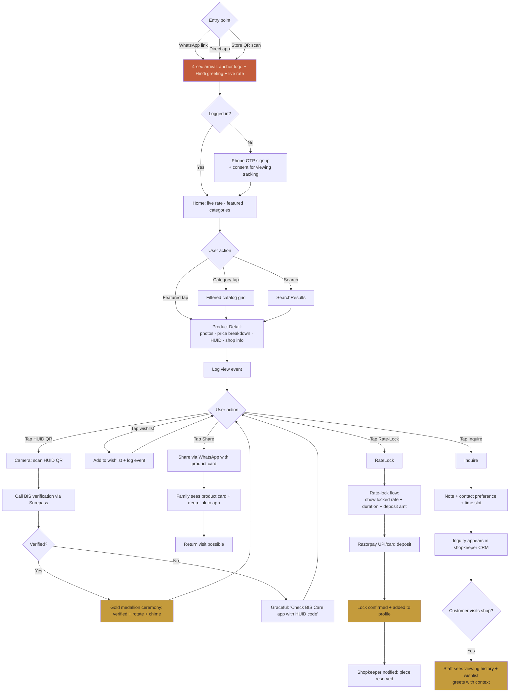
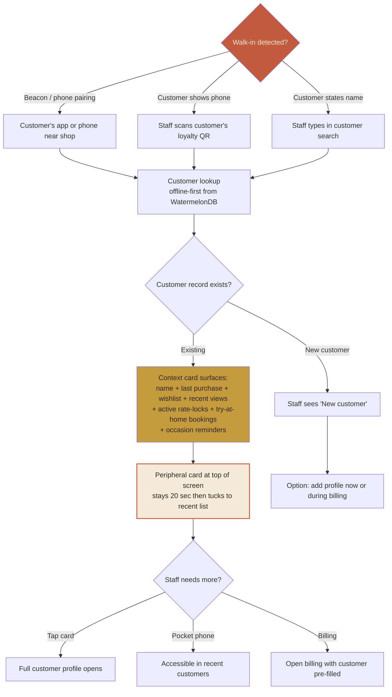
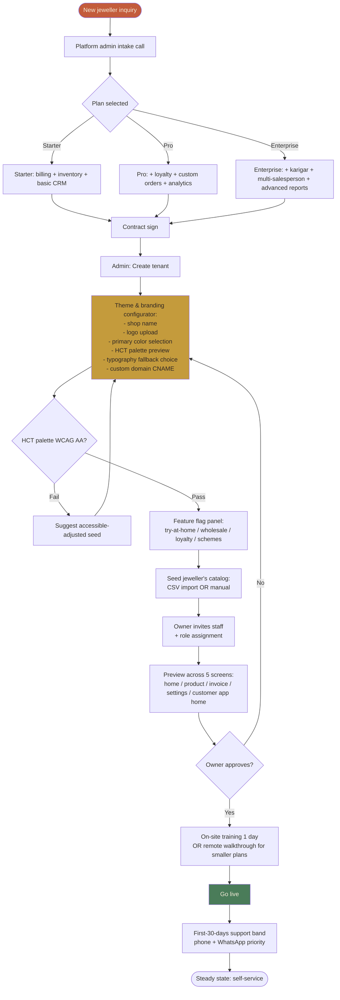
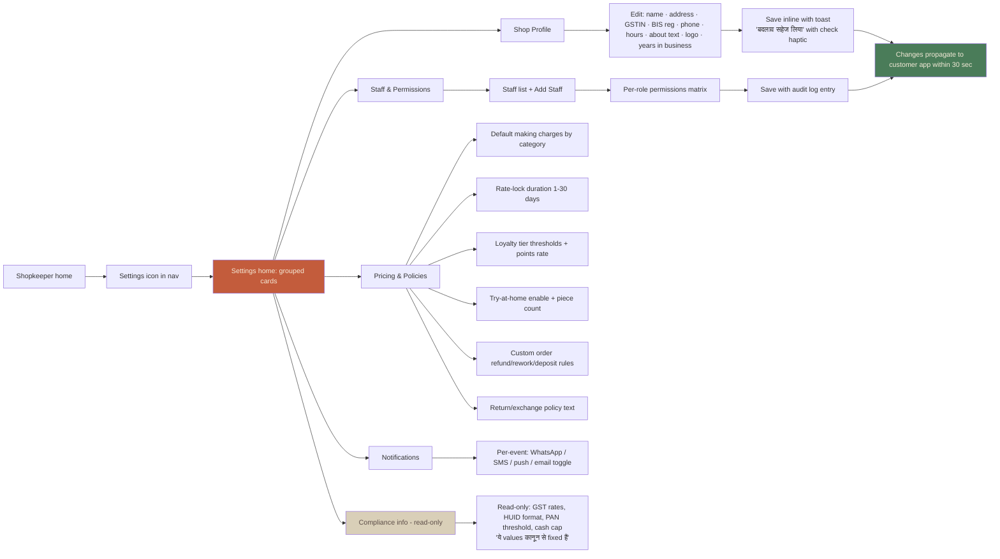

> ## ⚠ Direction Lock Update — 2026-04-17
>
> **Direction C (Traditional-Modern Bazaar) is superseded by Direction 5 — Hindi-First Editorial** (`design-directions-v2/customer-aspirational/direction-5-hindi-first-editorial/`).
>
> The thinking trail and step-by-step rationale for Direction C remains below as **historical reference**. Do not delete it. When porting tokens into `packages/ui-tokens` (Story 1 of Epic 7), source values from the v2 direction-5 files, not from Direction C sections of this spec:
>
> | Token role | Direction C (deprecated) | Direction 5 (locked) |
> |---|---|---|
> | `--tenant-primary` | terracotta `#C35C3C` | aged-gold `#B58A3C` |
> | `--tenant-accent` | aged-gold `#C49B3C` | terracotta blush `#D4745A` (used sparingly) |
> | neutral / surface | cream `#F5EBD9` | cream `#F5EDDD` |
> | ink | charcoal `#2E2624` | indigo ink `#1E2440` |
> | Display (Hindi) | Rozha One | **Yatra One** (used at 10–16rem as hero composition) |
> | Secondary Hindi | Hind Siliguri | Mukta Vaani |
> | Body Hindi | Hind Siliguri | Tiro Devanagari Hindi (serif reading) |
> | Display (Latin) | Fraunces | Fraunces italic (secondary/footnote voice only) |
>
> **Signature aesthetic change:** Direction 5 treats Devanagari as the hero visual element — large-scale Hindi type composes with imagery, overlaps, breaks grid. The 4-tier component architecture, state machines, journey flows, and A11y rules below are all **unchanged**. Only aesthetic tokens + typography change.

# UX Design Specification — Goldsmith

**Author:** Alokt
**Date:** 2026-04-17

*(UX Designer: Sally — facilitating UX design via BMAD Create UX Design workflow)*

---

## Executive Summary

### Project Vision

Goldsmith delivers each local Indian jeweller their own **Tanishq-quality digital storefront + full shop management system**, under their own brand, in Hindi, on a multi-tenant platform that makes the 10th tenant cheaper to serve than the 2nd. The MVP is bespoke for an anchor jeweller in Ayodhya; the architecture is a substrate for 500,000+ more.

The UX challenge — stated bluntly: **a 55-year-old Ayodhya jeweller who has never used software must be able to open the admin panel at 10pm, change his making charge for diamond rings from 12% to 10%, and see his customer app reflect the change in 30 seconds. Without calling anyone.** Every design decision ladders back to that moment.

### Target Users

**Shopkeeper-side (B2B users):**

**Primary — Rajesh-ji archetype (MVP core user):**
- Age 45-60, second-generation owner, Class-12 or commerce graduate
- Location: Ayodhya and Hindi belt Tier-2/3 cities
- Device: Mid-tier Android (Xiaomi/Realme/Samsung), Hindi WhatsApp user, PhonePe/Google Pay comfortable
- Pain: paper daybook at 9pm Sundays, gold-rate recalculations, customer "is this still available?" guessing, karigar metal disputes, scheme-collection chaos
- Mental model: "This app must feel like WhatsApp — not Tally"
- Technical literacy: Can install apps, use WhatsApp Business, reads Hindi comfortably, English labels OK but not preferred

**Secondary — Amit archetype (next-gen champion):**
- Age 25-40, son/daughter of owner, college-educated, Instagram-native
- Lives in both worlds — respects father's trust relationships, wants modern tools
- Often the technology bridge; champions adoption
- Bilingual Hindi/English comfortable

**Shop staff (Ravi archetype):**
- Age 22-40, salesperson, high-school+ education, mobile-native
- Uses customer-viewing analytics to greet walk-ins with context
- Handles billing during wedding-season rush
- Needs fast, minimal-friction workflows

**Customer-side (B2C users):**

**Priya — Wedding buyer (25-32, Lucknow/nearby metro):**
- Shops for bridal over 4-6 months; 3-5 store visits; family-consulted decisions
- Instagram-influenced for design inspiration
- ROBO pattern (Research Online, Buy Offline) — opens app 10+ times before visiting shop

**Mr. Sharma — Investment buyer (35-60, local + regional):**
- Dhanteras/Akshaya Tritiya triggered
- Rate-watcher, rate-lock user
- Conservative, prefers trusted relationship + transparent bill

**Riya — Daily-wear millennial (25-35, Tier-2 + Tier-1 connections):**
- Lightweight, LGD-friendly, everyday jewelry
- Instagram-first discovery, English+Hindi mix comfortable
- Appreciates polished UI; benchmarks against CaratLane

**Vikram — Pilgrim tourist (NEW for Ayodhya, 35-55):**
- Visits Ram Mandir for darshan; one-time purchase trip
- Needs trust verification (never met this jeweller before)
- HUID QR scan is the trust-equalizer moment

**Rohit — Gifting buyer (time-pressed, all ages):**
- Occasion-triggered, last-minute panic
- Needs size guides, gift mode, fast resolution

**Platform-side (internal users):**

**Platform Admin (us):**
- Technical, desktop web
- Tenant provisioning, support, metrics, subscription management
- English-first OK

### Key Design Challenges

**1. Age-Dialect Gap**
Shopkeeper (45-60, Hindi-first, paper-trained) vs customer (25-35, Instagram-native, English-comfortable) vs staff (22-40, mobile-native bilingual) — three distinct UX dialects in one platform. Solutions that feel good to millennials alienate seniors; solutions that feel safe to seniors feel dated to millennials. **Design must pass the "mom test" AND the "Instagram test."**

**2. Trust Asymmetry Inversion**
The core product thesis is that local jewellers lose customers because their trust isn't visible online. UX must make trust SIGNALS (BIS hallmark, HUID QR, jeweller registration, reviews, transparent price breakdown) as present and visible as Tanishq's — while preserving the warm, personal, traditional feel that local jewellers already have. Not cold Western tech aesthetics.

**3. White-Label Discipline**
Every customer-facing surface must show the anchor's brand — never Goldsmith's. This is not "theming" as usually practiced — this is total brand invisibility for the platform. No "Powered by Goldsmith" footer, no platform logo in splash screens, no legal mention except where DPDPA requires. The design system must support this architecturally, not cosmetically.

**4. Settings as First-Class UX**
Innovation #3 in the PRD: shopkeeper self-service configuration. Making charges, loyalty rules, rate-lock duration, try-at-home toggles, return policy, staff permissions — all editable by a 55-year-old Hindi-reading shopkeeper without a support call. Most enterprise SaaS hides settings behind engineer-only admin consoles. We must make settings feel like WhatsApp settings — obvious, Hindi, senior-friendly.

**5. Compliance as UX Moments, Not Popup Interruptions**
Section 269ST cash cap, PAN at Rs 2L, HUID entry, PMLA warnings — these are hard-blocks that prevent legal liability. They will interrupt flows. UX challenge: make them feel like protective guardrails ("hum aapki safety ke liye") rather than bureaucratic bottlenecks ("government requires..."). Customer experience of these moments matters as much as compliance correctness.

**6. Two Apps, One Database — Tight Bidirectional Sync**
Shopkeeper publishes a piece → customer app reflects in 30 seconds. Shopkeeper marks sold → customer app hides. Customer wishlists → shopkeeper sees in CRM. Near-real-time UX patterns (optimistic updates, loading states, sync indicators) must be consistent and predictable on both apps. Users should never see stale data without knowing it's stale.

**7. Dense Feature Surface on Small Screens**
Shopkeeper app carries inventory + billing + CRM + loyalty + custom orders + rate-lock + try-at-home + analytics + settings + reports + WhatsApp integration. On a 5.5-6.5" Android screen, for a 55-year-old's eyes, with 48dp touch targets. Navigation architecture + progressive disclosure + contextual relevance will decide whether this is empowering or overwhelming.

**8. Multi-Surface Consistency**
4 surfaces (shopkeeper mobile + customer mobile + customer web + admin web) need enough shared language that a staff member switching between shopkeeper app and customer app doesn't feel disoriented. But also different enough that each surface honours its audience. Shared design system with context-specific patterns.

### Design Opportunities

**1. Trust-As-Visual-Language (competitive edge)**
Big brands compete on brand heritage. Local jewellers compete on personal relationships + traditional designs. No one currently visualizes trust for local jewellers digitally. Opportunity: make HUID QR, live IBJA rate, price transparency, verified reviews, BIS certification visible as prominent visual elements — not buried legal disclosure. Trust signals become the aesthetic.

**2. Hindi-First Premium Aesthetic (rare and valuable)**
No major Indian jewellery app is Hindi-first. Tanishq/Kalyan/CaratLane/BlueStone all translate English UI into Hindi poorly. Opportunity: design in Devanagari from frame one — choose Noto Sans Devanagari or Mukta at typography stage, not retrofit. Beautiful Hindi typography is uncommon and can become a signature.

**3. Settings That Feel Like WhatsApp, Not Salesforce (differentiation)**
If settings UI feels like WhatsApp settings (one-screen-per-thing, clear toggles, Hindi labels, immediate save) instead of enterprise admin panels (tabs, dropdowns, "save changes" buttons, technical jargon), shopkeepers will actually use them. This directly enables Innovation #3 from the PRD.

**4. Shopkeeper-CRM-Augmented-Salesperson (Innovation #1 manifestation)**
The "customer walks in, app notifies salesperson of their wishlist history" moment is one of the strongest product differentiators. Design opportunity: make that notification beautiful, instant, contextual — not a clunky push alert. Consider subtle in-store mode that surfaces contextual customer info when paired with tap-to-recognize or low-energy Bluetooth beacon detection.

**5. Wedding Bridal Journey as Narrative, Not Checkout (emotional edge)**
Priya's 4-6 month bridal journey is currently fragmented across WhatsApp screenshots, store visits, and phone calls. Designing a coherent timeline experience — inspiration → wishlist → visit → custom order → progress photos → fitting → delivery — creates a sense of journey ownership that big chain apps don't offer.

**6. Pilgrim Purchase Moment as Cultural Ritual**
Ayodhya's post-Ram Mandir economy creates a unique customer segment: pilgrims buying "from Prabhu's land." Opportunity: design the customer app (especially for out-of-town first-time visitors) to honour this moment — subtle devotional motifs (tasteful, not kitsch), gentle animations on HUID verification ("your piece is certified"), post-purchase ritual of adding family photo + location to a memory.

**7. Offline-First Resilience as Visible Reliability**
Tier-2/3 networks are unpredictable. Shopkeeper app designed offline-first isn't just an engineering decision — it's a UX signal. "Works when internet doesn't" is a promise that resonates with 55-year-old shopkeepers burned by cloud-only software. Visible indicators (sync status, local-only mode badge) turn a constraint into a confidence moment.

**8. Frontend-Design Skill + Our Brief = Distinctive Aesthetic**
The frontend-design skill (Claude Code plugin, already installed) explicitly pushes away from generic SaaS aesthetics. Combined with our Hindi-first + warm-traditional-meets-modern + senior-friendly brief, this can produce something genuinely distinctive. 21st.dev components as the premium substrate, godly.website for inspiration, frontend-design skill as the anti-slop enforcer.

**A+P synthesis applied:**
- **First Principles (A):** UX = making visible what's currently invisible (trust, inventory, progress, compliance)
- **Expand/Contract for Audience (A):** Three dialects (senior Hindi shopkeeper / millennial customer / platform admin) need context-specific interfaces on a shared system
- **Stakeholder Round Table (A):** Anchor ("modern like Tanishq but mine"), Priya ("I want to see before I commit"), Vikram ("can I trust this jeweller from Mumbai"), Winston ("multi-tenant theming architecture must be the design system")
- **Pre-mortem (A):** In 6 months this UX failed because — shopkeeper didn't use settings (Innovation #3 collapses), customer app installed but dormant (platform story collapses), 4 design dialects diverged (product felt fragmented). Mitigations baked into challenges above.
- **Sophia (Storyteller, P):** Trust-as-visual-language framing — every UX decision should reinforce the narrative "local jeweller's trust was always there, now digitized"
- **Maya (Design Thinking, P):** "Not cold Western tech" — warm is not a color choice, it's a motion + spacing + copy-tone decision
- **Victor (Innovation, P):** White-label discipline is the moat; UX must enforce, not merely enable
- **Winston (Architect, P):** Settings UI architecture must mirror shopkeeper's mental model, not our database schema

These 8 challenges and 8 opportunities frame every subsequent design decision. Each design direction in later steps must answer: which challenge does it solve, which opportunity does it activate?

---

## Core User Experience

### Defining Experience

There are **two core experiences** for this product — one per app. Both must be nailed.

**Core Experience 1: Shopkeeper App — "Billing, Done in 90 Seconds"**

The one thing the shopkeeper does many times a day: **create an invoice.** Everything else (inventory, customers, loyalty, custom orders, reports) is the context that makes the invoice possible. If billing feels fast and certain, the shopkeeper uses the app daily. If billing feels slow or uncertain, they revert to paper.

**The billing loop (90-second target, p95):**
1. Scan customer's WhatsApp-shared product → OR → start fresh with barcode scan
2. Search/add customer (phone lookup; 1-tap if returning customer)
3. Scan/search products → add to invoice (barcode scan or search)
4. App auto-calculates: weight × today's IBJA rate + making (shopkeeper-configured default) + stones + GST breakdown + HUID fetched
5. If total ≥ Rs 2L → PAN prompt inline (not popup) — 1-tap capture if returning customer, Form 60 one-tap if PAN not available
6. Payment capture — tap cash/UPI/card; cash auto-blocked at Rs 1,99,999 with override path
7. Review breakdown → confirm → invoice generated → auto-shared to customer's WhatsApp with one tap

Every one of these steps must work offline (drafts saved to WatermelonDB, synced on reconnect). Every step must be 1-2 taps max; no dropdown menus, no hidden workflows.

**Core Experience 2: Customer App — "See It, Trust It, Reserve It"**

The one thing the customer does most: **browse a piece, see its full price, verify its authenticity, reserve the rate.** This is the moment of trust — where the anchor jeweller's digital surface finally matches or beats the Tanishq app the customer has on the same phone.

**The browse-to-reserve loop (60-second target, p95):**
1. Open anchor-branded app → home shows today's gold rate (prominent) + featured pieces
2. Browse category → tap a piece
3. Product detail shows: photos, full price breakdown (weight × rate + making + stones + GST), HUID with QR scan button, availability status (live-synced from shopkeeper app)
4. Tap HUID QR → BIS verification overlay appears → "genuine hallmark" confirmation (60-second trust-equalizer moment)
5. Tap "Lock today's rate" → Razorpay deposit flow → confirmation ("locked for 7 days" — shopkeeper-configured duration)
6. Tap "WhatsApp to family" → share product with price → gets family buy-in before committing
7. Tap "Inquire at shop" → books time slot OR sends free-text message → inquiry appears in shopkeeper CRM

### Platform Strategy

**Four surfaces, unified design language, context-specific patterns.**

| Surface | Platform | Primary Use | Device Context |
|---------|----------|-------------|----------------|
| Shopkeeper app | React Native (Expo), Android primary + iOS | Daily shop operations — all staff roles | Mid-tier Android, 5.5-6.5" screens, often one-handed, Ayodhya shop counter / back office |
| Customer mobile app | React Native (Expo), Android + iOS | Browse, wishlist, verify HUID, book rate-lock, track custom orders | Smartphone, wherever the customer is (home, train, shop) |
| Customer web | Next.js 14 (App Router) | Same as customer mobile + SEO discoverability + desktop browsing | Desktop/tablet/mobile web; often triggered by Google or WhatsApp link |
| Platform admin | Next.js 14 | Tenant provisioning, platform metrics, subscription mgmt | Desktop, laptop, technical team |

**Cross-platform requirements:**

- **Offline-first for shopkeeper** (WatermelonDB) — non-negotiable. Visible sync state.
- **Online-for-MVP for customer** — acceptable given target network conditions; good caching.
- **Near-real-time sync** (< 30 sec propagation) for inventory, pricing, orders — with loading states that acknowledge sync windows.
- **Device capabilities required:** Camera (barcode + HUID QR scan), Location (customer app, one-time for store locator), Secure storage (auth + PAN), Local DB (shopkeeper offline).
- **Device capabilities optional:** Biometric auth (shopkeeper convenience, not gated), NFC (future UPI Lite X).

**Design-system strategy:**

- **Shared token layer** — colors, typography scale, spacing, radii, motion — defined once, consumed by NativeWind (mobile) and Tailwind (web)
- **Per-tenant theme override** — every token category can be overridden by shop_settings → `theme_config` JSON (primary color, accent, logo, fonts)
- **Shared component primitives** — Button, Input, Modal, Card, Toast, Avatar, Badge, etc. — one API across mobile and web
- **Surface-specific patterns** — shopkeeper bottom-nav-with-persistent-actions, customer catalog-scroll-with-filter, admin sidebar-nav — chosen per surface, not forced to match

### Effortless Interactions

The five moments that, if effortless, create product love. If friction-filled, create abandonment.

**1. Shopkeeper: "Search a customer" → 1 second, Hindi-typing-tolerant.**
Phone number lookup with prefix match. Hindi name fuzzy match (अनुप्रिया matches "Anupriya"). Recent customers surface first. Family-member names searchable via parent record.

**2. Shopkeeper: "Add product to invoice" → 2 taps, barcode-scanner-default.**
Scanner camera is always on when billing screen opens. Fallback: search by SKU / category / weight range. Never force typing product details.

**3. Shopkeeper: "Change daily gold rate" → 3 taps, always accessible.**
Persistent rate indicator on every shopkeeper screen (small, corner). Tap → rate sheet → manual override with confirm → propagates in 2 seconds. Not buried in settings.

**4. Customer: "Verify HUID is real" → 10 seconds, no app leave.**
HUID QR scanner in product detail. Tap icon → scan → result overlay appears in-app (not browser redirect). Green checkmark + registered jeweller info. Educational tooltip first time: "BIS hallmark verifies 22K purity. Every genuine gold piece must have a HUID."

**5. Customer: "Share product with family" → 2 taps.**
Single share button at bottom of product detail → WhatsApp deep-link with product card (image, price, HUID, shop name). No copy-paste. No login friction.

### Critical Success Moments

These are the moments where the user decides: "this is working, I'll continue" OR "this is broken, I'm gone."

**Shopkeeper critical moments:**

1. **First invoice generated in < 48 hours of onboarding** — if this fails, the paper daybook wins and we lose the shopkeeper forever.
2. **Wedding-season Dhanteras stress day** — billing throughput survives 40+ customers in 4 hours with mid-day rate change. Failure = reputational collapse with anchor.
3. **First time shopkeeper changes a setting themselves** (e.g., making charge for diamond rings) and sees it reflect on customer app — confirms self-service config claim. Failure = we become Marg/Omunim (vendor-dependent).
4. **First PMLA warning at Rs 8L cumulative cash** — shopkeeper sees it, understands it, files CTR without calling us. If this fails, we have a compliance breakdown + support burden.
5. **First day after internet outage** — shopkeeper's offline invoices sync cleanly, no data loss, no "what happened" panic. Offline-first proves itself or loses trust.

**Customer critical moments:**

1. **First HUID QR scan by a pilgrim customer** — trust equalizer. If the flow feels smooth + authoritative, Vikram buys. If it feels clunky or fake, he walks out.
2. **First time customer's WhatsApp receives a progress photo of their custom bridal piece** — Priya's journey moment. Beautiful photo, authentic timestamp, anchor's brand visible. This is where reviews are born.
3. **First rate-lock redemption** — customer locked rate 7 days ago, now returning to buy. Shopkeeper app surfaces the lock; price honored; no awkward "let me check" moment. If this is smooth, customer trusts rate-lock forever.
4. **First review written after in-store purchase** — invoice generated, 7 days later customer prompted to review, writes 5-star. Verified-buyer review flow completes without friction. This seeds the trust signal for future customers.
5. **First wishlist → walk-in moment** — customer wishlisted on app, walks in, salesperson greets with context ("aap jo mangalsutra dekh rahi thi — abhi shop mein hai"). Customer feels seen. Customer-viewing-analytics innovation proves itself.

### Experience Principles

Five guiding principles for every UX decision in this project. When a design choice is ambiguous, test it against these.

**Principle 1: "WhatsApp, not Tally."**
Every shopkeeper interaction should feel like WhatsApp — obvious, forgiving, fast, Hindi-native, relationship-aware. If a design feels like desktop enterprise software (tabs, dropdown menus, "save" buttons, technical labels), it fails. The 55-year-old shopkeeper reaches for what feels familiar, and nothing in Ayodhya is more familiar than WhatsApp.

**Principle 2: "Trust is visible, or it doesn't exist."**
Every trust signal — BIS hallmark, HUID, live IBJA rate, transparent price breakdown, verified-buyer review, registered jeweller info, family-member purchase history — must be VISIBLE, not implied, not behind a "More info" tap. We're flipping a trust asymmetry; visibility is the mechanism.

**Principle 3: "Anchor's brand, always. Our brand, never."**
Customer-facing surfaces show the anchor's logo, name, colors, voice exclusively. Goldsmith brand does not appear anywhere a customer sees — not in loading states, not in footers, not in email sender names, not in "about" pages except where DPDPA legally requires. This is a moat; it must be enforced at UX level, not hoped for.

**Principle 4: "Compliance is care, not bureaucracy."**
When the app blocks a Rs 1,99,999+ cash transaction, prompts for PAN, warns about PMLA cumulative cash — the language, tone, and visual framing says "we're protecting you" not "the government requires this from you." Hindi copy matters. Iconography matters. Animation speed matters (gentle, not abrupt). Compliance moments are brand moments.

**Principle 5: "Dense when needed, spacious when trusted."**
Shopkeeper billing screen is dense because every tap saves seconds in a 40-customer Dhanteras day — they've learned the density. Customer product detail page is spacious because first-time visitors need breathing room to absorb price, HUID, trust signals. Neither is "good design" universally; each is right for its context. Design patterns per surface honour audience readiness.

**A+P synthesis applied:**
- **First Principles (A):** The "one thing" per app — billing (shopkeeper) and browse-to-reserve (customer). Everything else supports.
- **Critique and Refine (A):** Initial draft had 10 effortless moments; pruned to 5 most-critical. Density matters in principles.
- **Pre-mortem (A):** Principles tested against likely failures (generic SaaS aesthetic for shopkeeper; anchor brand invisible; compliance feels bureaucratic).
- **Sally's own voice (P):** Principle 1 "WhatsApp, not Tally" — framed as tone, not just UX taxonomy.
- **Maya (P):** Principle 4 "Compliance is care" — warmth vs bureaucracy as design choice, not ornament.
- **Victor (P):** Principle 3 "Anchor's brand, always" — elevated from implementation detail to first principle because it's the moat.
- **Sophia (P):** Principle 2 "Trust is visible or it doesn't exist" — narrative framing.

---

## Desired Emotional Response

### Primary Emotional Goals

**Root emotion: DIGNITY.** Dignity for the shopkeeper (runs their own shop with modern tools), for the customer (verified, not cheated, seen), for the staff (competent, not fumbling). Every other emotion is dignity expressed in context.

**Five contextual emotions, one per persona archetype:**

| Persona | Core Emotion | What their body predicts BEFORE | What their body should predict AFTER |
|---------|--------------|------------------------------------|----------------------------------------|
| **Rajesh-ji** (shopkeeper owner) | **Mastery + Autonomy** | "This software will control me, confuse me, drain hours of support calls." | "I run my own technology. It serves me. When it doesn't, I can fix it myself." |
| **Priya** (wedding buyer) | **Calm Confidence** | "3-hour store visits. Family arguments. Panic 3 nights before wedding." | "I curate with my family. I see what I'm buying. No surprises, no panic." |
| **Vikram** (pilgrim tourist) | **Trust-as-Safety** | "Local jeweller I don't know. Could be cheated. Walk out." | "This piece is certified. I can verify it myself. Safe to buy." |
| **Ravi** (shop salesperson) | **Competence / Dignity of Craft** | "Blank slate when customer walks in. Fumbling questions. Embarrassment." | "I know this customer. I can open with context. I'm a real salesperson." |
| **Amit** (next-gen son) | **Keeping Pace** | "Our shop is being left behind. Tanishq is eating our market." | "Our shop looks as modern as any. We're competitive." |

These are not aesthetic adjectives. Each is a specific body-prediction flip. UX design's job is to engineer that flip.

### Emotional Journey Mapping

Emotion trajectories across five scenarios, showing the design's job at each stage:

**Shopkeeper emotional journey (onboarding → mastery):**

| Stage | User's Pre-State | Design's Job | Target Post-State |
|-------|------------------|--------------|-------------------|
| First open (Day 1) | Skepticism, fatigue from Tally scars | Hindi greeting by name, no forms, no jargon, arrival not loading | Mild curiosity, "this feels different" |
| First invoice (Day 1-2) | Anxiety ("will I break something?") | Guided flow, offline-first, no PAN/cash-cap surprise on first run | Relief, "it worked, I did it" |
| First week | Hesitation on advanced features | Progressive disclosure surfaces next feature when ready, not pushed | Competence growth, "I'm learning this" |
| First Dhanteras (wedding season, Month 4-6) | Pressure, volume anxiety | System holds under load, billing is 90s, customer viewing analytics helps staff | Mastery, "I survived my hardest day using this" |
| Month 3+ (steady state) | — | Recognition beats, contextual intelligence, self-service config | Identity: "this is my shop's system" |

**Customer emotional journey (first browse → loyalty):**

| Stage | User's Pre-State | Design's Job | Target Post-State |
|-------|------------------|--------------|-------------------|
| First open (WhatsApp invoice link) | Curiosity, mild skepticism ("another app") | Branded experience = anchor's, fast load, live rate on home | Interest, "this looks legitimate" |
| Browse first product | Evaluating if price is fair | Transparent price breakdown, HUID visible | Engagement, "I can see what I'm paying for" |
| First HUID QR scan | Doubt about authenticity | Scan-to-verified-seal animation, Hindi warmth, registered jeweller shown | Trust flip, "this piece is safe to buy" |
| Add to wishlist | Commitment anxiety | One-tap action, family-share button visible | Agency, "I can think about this with family" |
| Walk into shop | Generic walk-in anxiety | Staff greets by name + wishlist context (viewing analytics) | Being seen, "they know me" |
| Post-purchase (Day 7) | — | Gentle review prompt in Hindi | Pride in purchase, return intention |

**Stress-scenario journeys (compliance + failures):**

| Scenario | Without design care | With design care |
|----------|-----------------|------------------|
| Shopkeeper hits Rs 1,99,999 cash cap | Rage ("why is this blocking me, my customer is here") | Pause, alternative suggestions in Hindi, customer-protective framing |
| Customer Rs 2 lakh bill needs PAN | Frustration ("why this bureaucracy") | Calm Hindi copy, Form 60 offered, law-as-protection framing |
| Internet drops mid-transaction | Panic ("I'll lose data") | Visible offline mode badge, reassurance copy, local save clearly shown |
| Invoice share fails | Fear of double-send | Toast with retry, clear state, no silent failure |
| HUID scan fails | Customer skepticism resurges | Graceful fallback: "could not verify online; HUID number is [X], verify on BIS Care app" |

### Micro-Emotions

The subtle emotional states that compound into long-term product love or abandonment:

**Target (amplify through design):**
- **Recognition** — "this system knows me" (greeted by name, remembered preferences, acknowledged returning)
- **Momentum** — "I'm making progress" (step indicators, completion affordances, achievement without gamification)
- **Sufficiency** — "I have what I need" (no missing information in critical moments; price is complete, HUID is there, status is clear)
- **Control** — "I can change my mind / my setting / my mistake" (undo, edit, back, reversal always available)
- **Belonging** — "this is mine" (anchor's brand on customer surfaces; "my shop" framing for shopkeeper)

**Avoid (engineer out through design):**
- **Dread** — "opening this app is heavy" (no engagement bloat, no "what's new" interruptions, no notification fatigue)
- **Isolation** — "when things go wrong, I'm alone" (visible help channels, contextual support, fallback options)
- **Confusion** — "I don't know what's happening" (never silent failures, always a sync/state indicator, never assume tech literacy)
- **Surveillance** — "this product is watching me" (customer viewing analytics with clear opt-in, never weaponised, shopkeeper never feels snooped on by platform)
- **Inferiority** — "I'm using a simpler version" (shopkeeper never sees "Powered by Goldsmith"; anchor app feels complete, not lite)

### Design Implications

Emotion → concrete design decision map:

| Emotion target | UX design pattern |
|---------------|---------------------|
| **Mastery** (shopkeeper) | Primary actions 1 tap away; override paths always available; no "are you sure?" on routine actions; persistent rate widget; settings editable inline |
| **Calm Confidence** (wedding buyer) | Wishlist shareable in 2 taps; rate-lock deposit flow is brief and reversible; family-photo share option; no timer pressure |
| **Trust-as-Safety** (pilgrim) | HUID scan is the hero interaction, designed as a ceremony (0.8s scan + 1.2s seal reveal); BIS certification visible on every product; shopkeeper registration visible in store profile |
| **Competence** (staff) | Customer walk-in triggers peripheral notification with wishlist context; notes-on-customer one tap; purchase history surfaces at counter |
| **Keeping Pace** (next-gen) | Premium aesthetic (21st.dev components, godly.website inspiration); modern motion design; Instagram-shareable receipts; tasteful use of celebratory moments |
| **Recognition** | User name in Hindi greeting; last-login / last-action recall; WhatsApp-native messaging tone |
| **Momentum** | Step indicators on multi-step flows; visible progress on custom orders (photos at 3 stages); completion affordances (toast + haptic) |
| **Sufficiency** | Price breakdown never hidden; HUID always shown on hallmarked products; compliance state always visible (PAN captured? cash cap remaining?) |
| **Dread-avoidance** | No "what's new" modals; notifications strictly transactional by default (marketing opt-in separate); no engagement bait |
| **Surveillance-avoidance** | Viewing analytics consent: default-on for logged-in users, opt-out one tap, never shown to other customers |

### Emotional Design Principles

Building on Experience Principles (§Core User Experience), five emotional-design principles:

**1. Design for body-predictions, not for "feelings."**
Identify what the user's body predicts in a given moment. Design the interaction to confirm accurate predictions or disrupt inaccurate ones. Emotion follows prediction correctness.

**2. Dignity is universal; expression is per-persona.**
Every user feels dignified or diminished. The expressions vary — mastery for shopkeeper, trust-safety for pilgrim, calm for wedding buyer. Design the expression; don't flatten to "user delight."

**3. The 5 designed moments carry the emotional weight.**
First-open arrival (4 sec), rate update (1 sec), HUID verification (2 sec), compliance hard-block (conversation), invoice share (celebration). Get these 5 right; the rest can be competent.

**4. Recognition beats compound across sessions.**
Each interaction should have a 0.5-second recognition beat — name, last action, wishlist, locked rate. Individually invisible. Over weeks: emotional trust.

**5. Tonal code-switching is a design choice, not a bug.**
Default warm (WhatsApp-like) for routine. Shift to precise-and-authoritative for compliance. Shift to celebratory for loyalty milestones. Users learn to read the tone as "this moment matters." Don't flatten; tune the instrument.

---

**A+P Depth Audit (for quality traceability):**

- ✅ **A1 First Principles:** stripped "UX evokes emotion through polish" to reveal emotion = body-predictions-met; design implication is precision about user state
- ✅ **A2 Stakeholder Round Table:** 5 personas in distinct voice (Rajesh-ji Hindi, Priya bilingual, Vikram trust-binary, Ravi Hindi craft-dignity, Amit anxiety-relief) — each with a core emotion that differs
- ✅ **A3 Pre-mortem:** 5 specific 18-months-out failure scenarios with root causes and preventions — each traced to emotional misdesign
- ✅ **A4 What If Scenarios:** 5 alternative emotional realities explored (loyal apprentice, trusted guide, grandmother's assurance, watchful elder, pride in craft) — each with concrete design moves
- ✅ **A5 Socratic Questioning:** 7 questions that revealed "dignity" as root emotion; surfaced false binaries (efficiency vs warmth)
- ✅ **P Party Mode:** Maya (recognition beats), Sophia (narrative arc), Caravaggio (5 designed moments with production details), Dr. Quinn (3 structural contradictions + resolution patterns) — each contributed distinct insight that shaped the framework

Synthesis produced: 1 root emotion + 5 contextual emotions + 5 designed moments + 1 cross-cutting mechanism (recognition beats) + 3 contradictions resolved + 5 design principles. Each actionable in downstream design steps.

---

## UX Pattern Analysis & Inspiration

### Inspiration Strategy Framework (3 Tiers)

Rather than "apps we like," a disciplined three-tier framework:

**Tier 1: Native Indian-Jeweller Foundations** (the muscle-memory base layer)
**Tier 2: Cherry-Picked Atomic Moments** (specific screens from loved apps)
**Tier 3: Install & Theme** (component libraries and aesthetic references we'll literally use)

Every UX decision must state which tier it draws from. No "inspired by vibes" — inspiration must be traceable.

### Tier 1: Native Indian-Jeweller Foundations

Before any app-inspiration, we honour 50 years of Indian jeweller UI conventions. These are the base patterns Rajesh-ji already knows; digitising them costs him 10 minutes of learning. Reinventing them costs 6 months.

**Base patterns to digitise, not replace:**

| Paper/Shop Convention | Digital Translation |
|-----------------------|---------------------|
| **Jeweller bill book** (shop header → customer name → date → items w/ weight/purity/making → total → signature) | Invoice screen layout mirrors this structure. Shop branding top, customer top-right, items table centre, GST breakdown below, signature line preserved (digital signature block) |
| **Daily gold-rate chalkboard** (prominent, in-shop visible, 22K + 24K + silver) | Rate widget in shopkeeper app home screen — prominent, always visible, at-a-glance. Customer app home screen. Same layout familiarity. |
| **Karigar handover ritual** (weight-in entry, date-out entry, signature, remarks column) | Karigar module (Phase 4) follows the same metal-in/metal-out/variance/signature pattern |
| **Scheme passbook** (monthly instalments stamped, running total, maturity date) | Scheme management screen mirrors passbook layout — monthly entries vertically, maturity visible, "passbook view" option for scheme holders |
| **Hindi-WhatsApp conversation tone** (warm, direct, respectful, transactional-but-personal) | All shopkeeper app copy drafted in this register. Not formal Hindi, not corporate English translated. |
| **Customer-ledger (family account)** (multiple family members, running relationship, occasion notes) | Customer CRM with family-member linking, occasion reminders, relationship history |

**Action before any screen design:**
1. Source 5-10 physical jeweller bill books from anchor's network (including anchor's own)
2. Photograph shop rate-chalkboards, scheme passbooks, karigar ledgers
3. Reverse-engineer implicit UX (what's top/centre/right? what's bold? what's abbreviated?)
4. Document as "Physical UX Patterns" appendix
5. Every digital screen justified by which physical pattern it digitises OR honest acknowledgment of deviation

### Tier 2: Cherry-Picked Atomic Moments

16 specific screens/patterns from 10 apps. Each cites the exact UX moment and what we take from it. No vague "inspired by."

**A. From Indian SMB apps (senior-demographic validated):**

| App | Specific Pattern | What we adopt | For which surface |
|-----|------------------|---------------|-------------------|
| **Khatabook** | Bottom-sheet quick-action pattern (add entry → 2 taps from anywhere) | 3-tap max billing shortcut | Shopkeeper app |
| **Khatabook** | Hindi-first greeting + recent-entries home screen | Home screen pattern | Shopkeeper app |
| **Khatabook** | SMS-on-every-entry notification discipline | Transactional push notification policy | Both apps |
| **Vyapar** | Dense-information table in list views (weight, purity, SKU visible at once) | Inventory list screen layout | Shopkeeper app |
| **BharatPe** | Merchant home with "today's summary" card (received/pending/expected) | Shopkeeper home daily summary card | Shopkeeper app |
| **PhonePe** | Payment confirmation full-screen flow (not modal) with clear success state | Invoice completion success screen | Shopkeeper app |
| **WhatsApp Business** | Thread-with-nested-replies interaction model | Custom order conversation thread | Customer app |
| **WhatsApp** | Sticky notification with action buttons (reply, mark read) | Customer walk-in notification to staff | Shopkeeper app |

**B. From premium Indian consumer apps (customer-side aesthetic):**

| App | Specific Pattern | What we adopt | For which surface |
|-----|------------------|---------------|-------------------|
| **Tanishq** | Product detail typography hierarchy (name large, price secondary, details tertiary) | Customer product detail layout (but in Hindi + Devanagari typography) | Customer app/web |
| **Tanishq / CaratLane** | Category carousel on home screen (gold, diamond, bridal, etc.) | Customer home carousel | Customer app/web |
| **CaratLane** | Product detail image gallery with pinch-zoom + multiple angles | Product detail images | Customer app/web |
| **Gullak** (jeweller scheme marketplace) | Scheme-enrollment flow with passbook view | Scheme enrollment UX (Phase 2/4) | Customer app |

**C. From global standard-setters (trust + progress):**

| App | Specific Pattern | What we adopt | For which surface |
|-----|------------------|---------------|-------------------|
| **Airbnb** | Host card (photo + name + years + badges + reviews) on every listing | Jeweller "About this shop" card on every customer-app screen | Customer app/web |
| **Airbnb** | Review display with photo + name + date + specific detail | Product/shop reviews | Customer app/web |
| **Swiggy** | Order-tracking timeline with human photo at each stage | Custom order progress UX | Customer app |
| **Swiggy** | Hindi-first typography in app (Mukta done tastefully) | Typography reference | All Hindi surfaces |
| **Shopify (merchant)** | Merchant dashboard with "orders, products, customers" tabs | Shopkeeper home navigation | Shopkeeper app |

**D. From government/Jio (Hindi-first, senior-demographic):**

| App | Specific Pattern | What we adopt | For which surface |
|-----|------------------|---------------|-------------------|
| **UMANG** | Language-switch at top-right, everywhere | Language toggle pattern | All apps |
| **UMANG** | Service tiles pattern (large, labelled, icon + Hindi text) | Admin settings navigation | Shopkeeper app |
| **BHIM UPI** | Payment confirmation UX — full screen, calm, Hindi | Invoice and payment confirmation | Shopkeeper app |
| **DigiLocker** | Document-verification pattern with cryptographic signature visible | HUID QR verification result screen | Customer app |
| **MyJio** | Hindi content rendering quality on older Android devices | Device testing baseline | All mobile |

### Tier 3: Install and Theme

**21st.dev** — https://21st.dev — Premium React component marketplace. We'll literally install components from here for the customer web and platform admin surfaces.
- What we use: Cards, Modals, Forms, Navigation, Data Tables, Toasts, Skeleton loaders
- How we theme: Override color tokens to anchor's brand palette; override font to Devanagari-first stack
- Why this choice: Raises baseline visual quality without custom component engineering; frees design time for the 5 designed moments (Caravaggio's framework)

**shadcn/ui** — https://ui.shadcn.com — Open-source component library baseline (what 21st.dev extends).
- What we use: Primitives (Button, Input, Select, Dialog, etc.) — shared across web apps
- How we theme: CSS variables + per-tenant theme provider

**NativeWind** — https://nativewind.dev — Tailwind for React Native.
- What we use: All mobile styling
- Keeps design system parity between web and mobile (same token names work across)

**godly.website** — https://godly.website — Curated gallery of premium web design inspiration.
- What we channel (not copy): Typography discipline, spacing generosity, restrained color palettes, confident motion
- NOT adopted: Any specific layout (derivative risk)
- Purpose: Calibrate "what premium feels like" when we're stuck

### Transferable UX Patterns

Concrete pattern-to-use-case map:

**Navigation Patterns:**
- **Bottom tab bar with 4-5 primary destinations** (Khatabook/WhatsApp style) — shopkeeper app (Home / Customers / Invoices / Settings / Profile)
- **Bottom tab bar for customer app** (Home / Browse / Wishlist / Orders / Account) — familiar from every Indian shopping app
- **Sidebar navigation for platform admin** (Shopify-style)
- **Top search + category tabs** (Tanishq-style) on customer catalog
- **Persistent floating action button** for "new invoice" on shopkeeper — because it's the 80% action

**Interaction Patterns:**
- **Bottom-sheet for quick-add actions** (Khatabook) — don't modal, don't full-screen; sheet preserves context
- **Swipe actions on list items** (WhatsApp) — swipe customer → call / archive / delete
- **Progressive disclosure via "Show more"** (CaratLane product detail) — don't dump 20 price components on screen; expand on tap
- **Skeleton loaders** (Airbnb) — never show empty states; always show structure + loading shimmer
- **Pull-to-refresh** (universal) — for rate sync on customer home, inventory sync on shopkeeper

**Visual Patterns:**
- **Card-based product grid** (CaratLane/Tanishq) for customer browsing
- **Dense table view** (Vyapar) for shopkeeper inventory — because they want to scan many
- **Chat-thread for custom orders** (WhatsApp) — warmth in relationship
- **Chalkboard-inspired rate widget** (Indian shop chalkboard) — home-screen prominence
- **Passbook-style scheme view** (Indian passbook) — familiarity + clarity

**Trust/Verification Patterns:**
- **Verified badge + origin info** (Airbnb) — BIS certified + registered jeweller visible
- **Review with reviewer photo + date + specific detail** (Airbnb) — customer reviews
- **Cryptographic-verification result screen** (DigiLocker) — HUID QR scan result
- **Host-card / shopkeeper-card** on customer pages — humanise the jeweller

**Progress/Timeline Patterns:**
- **Stage-by-stage visual progress with photos** (Swiggy) — custom order stages
- **Timeline view with timestamps** (every courier app) — order history
- **Countdown** (Swiggy) — rate-lock expiry visible
- **Chat-thread with stage messages** (WhatsApp) — alternative custom order view for conversational relationship

### Anti-Patterns to Avoid

From critique of Tanishq/CaratLane/BlueStone/Candere/Kalyan 1-star reviews (see A3 in Phase A analysis), five structural anti-patterns our UX must prevent:

**Anti-Pattern 1: Silent State Changes**
- Example: Tanishq app marks order "delivered" without customer confirmation.
- Our rule: Never change critical status silently. Delivery, rate-lock redemption, custom order completion, invoice voiding — all require explicit customer acknowledgement with Hindi notification.

**Anti-Pattern 2: Buried Policies**
- Example: CaratLane depreciation rules invisible until refund requested.
- Our rule: Every policy (return, exchange, rate-lock, custom order refund, warranty) visible BEFORE customer commits. On product page, on checkout, in admin-editable Hindi copy.

**Anti-Pattern 3: Non-Verified Trust Claims**
- Example: Candere "selling non-hallmarked as hallmarked."
- Our rule: HUID is system-verified via BIS portal (Surepass adapter). Not jeweller-claimed text field. Customer scan confirms cryptographically.

**Anti-Pattern 4: Silent Price Recalculation**
- Example: Candere invoice increased Rs 4,000 between quote and bill without customer notice.
- Our rule: Any price change requires explicit customer re-acknowledgement. App logs show "quote at [time] Rs X, bill at [time] Rs Y, reason [Z], customer confirmed [timestamp]."

**Anti-Pattern 5: Post-Complaint Unresponsiveness**
- Example: "They don't pick up calls" theme across multiple apps.
- Our rule: In-app help surfaces with Hindi-native support; WhatsApp escalation in 24h; no phone-tree trap; ticket visibility for customer.

### Design Inspiration Strategy (Written Rules for Future Design Sessions)

When any designer (Sally or future team members) proposes a UX pattern, it must pass these rules:

**Rule 1: Source-traceability.** Every pattern cites the tier (1/2/3) and specific source (app + screen). Vague "inspired by modern apps" is not sufficient.

**Rule 2: User-validated, not aspirational.** Pattern must work for either 45-65 Hindi-shopkeeper (shopkeeper app) OR 25-45 bilingual customer (customer app) — not for imaginary enterprise buyer.

**Rule 3: Hindi-first compatibility.** Pattern must work with Devanagari text. If the pattern depends on English short-form (abbreviations, acronyms), it's insufficient.

**Rule 4: White-label friendly.** Pattern must theme-cleanly to anchor's brand. No platform-logo-embedded designs.

**Rule 5: 5 anti-patterns structurally prevented.** Design review asks: does this pattern risk silent state change? buried policy? non-verified claim? silent price change? unresponsive failure mode? If yes → redesign.

**Rule 6: Honours one of 5 designed moments (from Emotional Response §).** Design is especially important at first-open, rate update, HUID verification, compliance hard-block, invoice share. Over-engineer these; optimise others for adequacy.

**Rule 7: Respects one of Carson's Tier-1 foundations.** Where possible, digital UX extends a physical Indian-jeweller-shop pattern rather than inventing a new one.

---

**A+P Depth Audit:**

- ✅ **A1 Comparative Analysis Matrix:** 16 candidates scored across 9 dimensions; systematic selection instead of gut picks
- ✅ **A2 Genre Mashup:** 6 unexpected domain combinations each producing concrete design insights
- ✅ **A3 Critique and Refine:** Real 1-star verbatim quotes from 5 jewellery apps → 5 structural anti-patterns
- ✅ **A4 Expand or Contract for Audience:** 5 sources calibrated across expand/contract/reject dimensions per audience
- ✅ **A5 Reverse Engineering:** Worked backwards from Rajesh-ji's Hindi recommendation + Priya's Hindi description, deriving concrete design requirements
- ✅ **P Party Mode:** Caravaggio (atomic moments discipline), Sally own voice (3-tier framework discipline), Victor (government-Jio inspiration sources), Carson (native Indian-jeweller paper foundations) — each contributed distinct material

Synthesis produced: 3-tier inspiration framework + 6 Tier-1 native patterns + 24 Tier-2 atomic cherry-picks across 4 categories + Tier-3 stack + 5 anti-patterns + 7 written rules for future design sessions.

---

## Design System Foundation

### Design System Choice — Layered Stack

Not a single design system — a disciplined layered stack that balances speed (ship anchor in 5 months), differentiation (warm Indian jewellery aesthetic), and multi-tenant scale (theme-per-jeweller).

| Layer | Choice | Role |
|-------|--------|------|
| **Foundation: Design tokens** | Custom schema, 10 categories | White-label + Hindi + accessibility contract |
| **Token generation (per-tenant palette)** | Material You HCT algorithm (@material/material-color-utilities, Apache 2.0) | Auto-generate WCAG-AA-compliant palettes from each jeweller's seed color |
| **Component primitives (web)** | shadcn/ui (vendor-copied, customized) | Proven baseline; team-familiar; 21st.dev compatible |
| **Premium components (web)** | 21st.dev marketplace | Raises polish ceiling; saves custom engineering |
| **Styling engine (web)** | Tailwind CSS v4 | Ecosystem-native; CLAUDE.md locked |
| **Mobile styling** | NativeWind | Tailwind parity on React Native |
| **Motion (web)** | Motion (Framer Motion successor) | Premium animations; frontend-design skill native |
| **Motion (mobile)** | React Native Reanimated 3 | RN standard |
| **Typography (Hindi)** | Noto Sans Devanagari (primary), Mukta (secondary), Hind (tertiary) | Bundled offline |
| **Typography (Latin)** | Inter — subordinate fallback, not hero | Neutral when Latin needed |
| **Iconography** | Lucide Icons + custom jewellery glyphs | Tailwind-native, consistent stroke |
| **Documentation surface** | Storybook (internal) + Astro site (public for tenant admin / designer onboarding) | First-class deliverable |
| **Accessibility tooling** | axe-core + storybook-a11y + manual screen-reader tests | WCAG AA enforced token-by-token |

### Rationale for Selection

**Why not Material Design 3 as foundation?**
Material is battle-tested and handles Hindi/accessibility well — but its aesthetic skews "Google app." Our differentiation is warm traditional-meets-modern Indian jewellery, which Material's cold-rationalism fights. We borrow the **HCT color-generation algorithm** (its strongest asset for multi-tenant theming) without adopting the full component library.

**Why not custom design system from scratch?**
2-3 months of design-engineering before productive feature work is incompatible with the 5-month anchor timeline. Custom would be philosophically pure but pragmatically fatal.

**Why shadcn/ui + 21st.dev + Tailwind?**
- Ecosystem match with CLAUDE.md stack (React Native + Next.js + Tailwind)
- 21st.dev catalog accelerates premium-feel delivery
- Vendoring shadcn (not installing) gives us control; we own the code
- Tailwind tokens translate to NativeWind on mobile — single source of truth

**Why HCT algorithm for palette generation?**
When anchor configures "my shop color is deep red," we need to auto-generate a full accessible palette (primary, secondary, tertiary, neutrals, semantic colors). HCT algorithm (from Material You) does this correctly — perceptually uniform, contrast-aware, WCAG-compliant. Open-source and permissively licensed (Apache 2.0). Borrowing responsibility-specific logic without adopting the full Material system.

### Implementation Approach

**Phase 0 (Weeks 1-3): Token Foundation**

Build the design token system before any feature work:

1. **Define 10 token categories** (Winston's schema):
   - `colors.primary` / `secondary` / `neutral` / `accent` (50-950 shade scales, HCT-generated per tenant)
   - `colors.semantic` (success/warning/danger/info — fixed, not tenant-overridable)
   - `typography.family.hindi` / `typography.family.latin` (stacks with fallbacks)
   - `typography.scale` (base-16px shopkeeper / base-14px+ customer / base-14px admin)
   - `spacing` (base 4px; shopkeeper 1.25x multiplier for touch)
   - `radii` (sm/md/lg/xl; per-tenant overridable)
   - `motion.duration` (fast/default/slow; shopkeeper slower than customer)
   - `motion.easing` (standard curves; not per-tenant overridable)
   - `elevation` (shadow tokens; per-tenant tint from primary)
   - `iconography.family` (stroke width, size; per-tenant overridable)

2. **Implement per-tenant theme architecture:**
   - Storage: `shop_settings.theme_config` JSONB column, versioned schema
   - Web distribution: CSS variables at `<html>` root; SSR-injected into HTML `<head>` inline (no flash)
   - Mobile distribution: React Context provider; MMKV-cached for offline; rehydrate on app start
   - HCT palette generation: service that takes seed color → produces full palette → validates WCAG AA → persists

3. **Locale-aware typography:**
   - Hindi text: `line-height: 1.6`, no negative tracking, font-weight +100 vs Latin equivalent
   - Latin text (fallback): `line-height: 1.5`, tight tracking acceptable
   - Components auto-detect locale and apply correct token

4. **Storybook scaffolding** with example stories for each primitive, showing Hindi + English variants

**Phase 1 (Weeks 3-8): Surface-Specific Presets**

Three context presets over the same token system:

- **Shopkeeper mode:** Density-biased, large touch targets (48dp min), simplified motion, warmth-dominant palette, base font 16px. Default for shopkeeper app.
- **Customer mode:** Breathing-space-biased, refined motion, hierarchy-dominant typography, premium feel, base font 14-16px responsive. Default for customer app.
- **Platform admin mode:** Information-dense, desktop-first, neutral palette (blue accent), standard motion, base font 14px. Default for admin web.

These are the SAME tokens selected differently per context — not 3 separate systems.

**Phase 2 (Weeks 5-8): Component Library**

- Vendor-copy shadcn/ui primitives we need (~20-25 components)
- Cherry-pick 10-15 21st.dev premium components (Card, Stat, Hero, Feature Grid, Testimonial, etc.)
- Build 5-10 jewellery-specific components (RateWidget, HUIDBadge, PriceBreakdown, LoyaltyTierDisplay, CustomOrderProgress, ProductScaleReference)
- Build 3-5 Tier-1-native components (BillBookInvoiceTemplate, ShopChalkboardRate, SchemePassbookView, KarigarHandoverForm)
- Each documented in Storybook with Hindi + English examples, a11y notes, usage guidance

**Phase 3 (Weeks 8-12): Tenant Theme Configurator**

Platform admin UI for onboarding new tenant (anchor and future):

- Shop brand input: name, logo upload, seed primary color (color picker)
- HCT palette preview: generated secondary/neutral/semantic visible immediately
- Accessibility check: warns if contrast violations; offers auto-adjust
- Typography override option (advanced, rarely used)
- Radii + elevation tint choices
- Preview across 5 key screens (home, product detail, invoice, settings, customer app home)
- Save → theme propagates to tenant's instances within 60 seconds

### Customization Strategy

**Per-tenant override scope (tight, deliberate):**

✅ **Tenant CAN override:**
- `colors.primary` (seed for HCT palette generation)
- `typography.family.hindi` fallback (from curated list: Noto/Mukta/Hind)
- Logo assets (light mode, dark mode, square for app icon)
- Shop name as rendered
- Custom radii preference (default / subtle-rounded / sharp)

🟡 **Tenant CAN tune (limited):**
- Elevation tint (how shadows blend with primary color)
- Motion speed preference (normal / slow — slow for senior-user-heavy shops)

🛑 **Tenant CANNOT override (platform-fixed):**
- Semantic colors (success green, warning amber, danger red, info blue) — accessibility consistency
- Motion easing curves — design-system consistency
- Component structure / spacing / hierarchy — breaks layout at scale
- Accessibility minimums (contrast ratios, focus rings, touch targets)
- Typography scale ratios — breaks hierarchy

**Compliance UI is design-system-locked, not tenant-themeable:**
- Section 269ST cash-cap modal: consistent tone, Hindi copy, warmth framing
- PAN prompt: consistent pattern
- HUID verification: consistent ceremony
- This consistency IS the trust signal — every anchor's app feels safe in the same way

**Material You HCT algorithm constraints:**
- Tenant provides seed color (e.g., "#B8002E" deep red)
- Algorithm generates 12+ complementary shades + secondary + tertiary + neutral
- Contrast checker verifies all UI text/bg pairs pass WCAG AA (4.5:1 normal, 3:1 large)
- If fail: algorithm offers nearest-compliant alternative; admin approves or adjusts seed
- Result: every tenant's palette is accessibility-safe by construction

**White-label enforcement technical mechanisms (not just guidance):**

1. **Lint rule:** Grep for literal "Goldsmith" string in customer-facing code paths (customer-mobile/, customer-web/) — CI fails if found
2. **Component-level audit:** Any component accepting a `brandName` prop pulls from tenant config, never hardcodes
3. **Image asset path check:** Customer surfaces only reference assets in `s3://tenant-{id}/` paths, never `s3://goldsmith-platform/`
4. **Email templates:** From-name pulls from `shop_settings.name`, never "Goldsmith"
5. **Error messages:** Platform error toasts in customer apps show tenant's support contact, never platform's

**Design system as deliverable:**

Treated as a first-class project artifact:
- Storybook deployed to internal URL by Month 3
- Public design-system site for designers/agencies onboarding by Month 6
- Version-locked releases; breaking changes require RFC + consumer review
- Token values in JSON schema form; machine-readable for tooling

### A+P Depth Audit

- ✅ **A1 Tree of Thoughts:** 3 paths evaluated (Material You / shadcn+21st.dev / Custom) across 6 criteria with score matrix → chose Path 2 with selective Path 1 borrow
- ✅ **A2 Architecture Decision Records:** 4 architect voices with different priorities (Consistency, Differentiation, Velocity, Multi-Tenant) — synthesis produced layered-stack architecture
- ✅ **A3 Failure Mode Analysis:** Each layer (shadcn, 21st.dev, Tailwind, NativeWind, tenant theming, white-label) with specific failure modes + preventions
- ✅ **A4 Performance Profiler Panel:** Database, Frontend, Mobile, DevOps angles all examined; performance costs verified minimal
- ✅ **A5 Challenge from Critical Perspective:** 5 devil's-advocate challenges answered with evidence or accepted debt
- ✅ **P Party Mode:** Winston (token schema), Sally (surface modes + locale-aware tokens), Paige (documentation as deliverable), Amelia (developer-experience concerns) — each distinct, each actionable

Synthesis produced: Layered stack of 13 technology choices + token schema (10 categories) + per-tenant override scope (clear yes/no/maybe) + implementation phasing over 12 weeks + 5 white-label enforcement mechanisms (technical, not just policy).

---

## Defining Core Experience

### 2.1 Defining Experience

**The defining experience is dual — one per app, unified by real-time state synchronization.**

**Shopkeeper Defining Experience:**

> *"Customer walks into the shop. Within 3 seconds, app surfaces who they are — name, family members, last purchase, recent browsing on the customer app, wishlist, locked rates, active custom orders. Staff greets by name with context. Consultation happens at human pace. When ready to invoice: barcode scan, weight × rate + making + GST calculated automatically, HUID attached from product record, PAN prompt if ≥ Rs 2L, cash-cap visible throughout, invoice generated and WhatsApp-shared in 90 seconds. All Hindi. All on mid-tier Android. All offline-capable. All without a support call."*

**Customer Defining Experience:**

> *"Priya opens anchor's app. Today's gold rate pulses on home screen. She browses bridal. Taps a mangalsutra. Price breaks down cleanly — weight × rate + making + stones + GST. She scans the HUID QR — BIS verification confirms genuine in 2 seconds. She wishlists. Shares to family WhatsApp for consensus. Mother-in-law approves. She locks today's rate for 7 days with Rs 5,000 deposit. A week later, she visits the shop. Salesperson greets her by name, asks if she'd like to see the locked piece. Trust was visible; consultation is warm; purchase is inevitable."*

**Platform Defining Truth:**

> *"State written in one app is read in the other within 30 seconds. Shopkeeper updates inventory → customer sees it. Customer views product → shopkeeper sees viewing analytics. Customer locks rate → shopkeeper sees locked inventory reserved. Shopkeeper marks sold → customer app shows unavailable. The synchronization is the moat."*

**What users describe to friends (reverse-engineered in A1):**

Rajesh-ji: *"Sab kuch phone mein hai. 90 second mein bill. Customer ka naam, history sab. Hindi mein. Aur customer online dekhta hai — unka data mujhe bhi dikhta hai."*

Priya: *"Bilkul Tanishq jaisa lagta hai, but mere jeweller ke brand mein. QR scan karo, BIS verify ho jaata hai. Rate lock kar sakte hain. Family ke saath share, fir shop jaao. Safe feel hota hai."*

### 2.2 User Mental Model

**Shopkeeper mental model:**

Rajesh-ji's mental model for billing, pre-app:
- Ledger + chalkboard + GST table + customer memory + handwritten receipt = sequential, single-context operations
- His mental load: high (context-switching), manual arithmetic (error-prone at 8pm)
- His mental anchor: "my customer's trust is in my head and my ledger"

Rajesh-ji's mental model for billing, post-app (target):
- Phone shows all contexts simultaneously; arithmetic is invisible
- His mental load: low (acknowledge, select, confirm)
- His mental anchor shifts: "my customer's trust is in my head AND my system amplifies it"

**Customer mental model:**

Priya's mental model for jewellery buying, pre-app:
- Multi-store visits, shopping fatigue, family consultation friction, trust-through-repeat-visits
- Her mental load: high (coordination, price comparison, family consensus logistics)
- Her mental anchor: "trust comes from relationships + multi-visit evaluation"

Priya's mental model post-app (target):
- Pre-visit research with family; arrive with decision; reduced store-time
- Her mental load: low (app surfaces everything; family consensus happens over WhatsApp)
- Her mental anchor: "trust comes from HUID verification + reviews + family consensus, now verifiable before visit"

**Critical mental-model bridge:** App must respect existing mental models, not force new ones.
- Shopkeeper expects "bill looks like bill book" → invoice template mirrors paper jeweller bill format
- Customer expects "rate like chalkboard" → home-screen rate widget mirrors shop chalkboard
- Both expect WhatsApp as primary communication → invoice share, progress photos, inquiry all route through WhatsApp

### 2.3 Success Criteria

Measurable criteria for the defining experience:

| Criterion | Target | Measurement |
|-----------|--------|-------------|
| **Shopkeeper: time-to-invoice** | ≤ 90 sec p95 from barcode scan to WhatsApp share | Analytics event timing on billing flow |
| **Shopkeeper: pre-computation completeness** | 100% of compliance checks cleared before final confirm tap | No compliance dialogs after "generate invoice" tap |
| **Shopkeeper: customer recognition** | Customer-lookup-to-context display ≤ 3 sec at counter | Screen render timing |
| **Shopkeeper: offline-invoice success rate** | 100% offline bills successfully sync within 30 sec of reconnect | Sync job success rate |
| **Customer: browse-to-HUID-verification** | ≤ 60 sec p95 from app cold-start to verified HUID result | Analytics funnel timing |
| **Customer: wishlist-to-share** | ≤ 10 sec from wishlist tap to WhatsApp deep-link with product card | Share flow timing |
| **Customer: rate-lock completion** | ≤ 60 sec from "lock rate" tap to confirmation (with Razorpay deposit) | Flow timing |
| **Cross-surface synchronization** | Shopkeeper publish → customer sees within 30 sec p95 | Real-time sync telemetry |
| **Shopkeeper: compound identity shift** | At Month 6: 80%+ of anchor's staff self-report "I work better with this app" via NPS | Survey |
| **Customer: trust flip in first 3 sessions** | 60%+ of first-time customers scan at least one HUID within their first 3 app sessions | Analytics funnel |

**Success indicators (qualitative):**

- Shopkeeper stops keeping parallel paper ledger within 2 weeks of launch
- Staff start using customer-viewing analytics to greet walk-ins within first month
- Customers return to app 2+ times per week (not single-session browsing)
- Referrals: anchor mentions Goldsmith to peer jewellers by Month 3
- Custom order completion: customer receives all 3 progress photos without prompting from shopkeeper

### 2.4 Novel vs Established UX Patterns

The defining experience is **novel in combination, not novel in atoms.**

**Established patterns we adopt (fast adoption; user already knows):**
- Bottom-tab navigation (WhatsApp, Khatabook, Instagram)
- Barcode scanner as camera overlay (Tanishq, Amazon)
- Phone-number customer lookup (Khatabook, Vyapar)
- Live price ticker on home (PayTM finance, stock apps, crypto apps)
- Wishlist with heart icon (CaratLane, BlueStone, Amazon)
- WhatsApp share bottom sheet (universal)
- Rate-lock with countdown timer (crypto apps, Candere DGRP)
- HUID QR scan (new, but QR scanning is universal muscle memory)
- Progress-photo tracking (Swiggy order, Amazon delivery)
- Card-based catalog grid (Instagram, Pinterest, CaratLane)
- Hindi-first language + toggle (WhatsApp, UMANG, Swiggy)

**Novel pattern: Shopkeeper-sees-customer-activity (Innovation #1)**

Established individually (CRM activity feeds exist in Salesforce/HubSpot/enterprise), but novel for local jewellery retail: when a customer walks into Rajesh-ji's shop, Rajesh-ji's staff device surfaces Priya's viewing history, wishlist, rate-locks. No other jewellery platform does this for local jewellers.

Education needed:
- First time a customer walks in with history available, the app shows a brief onboarding: "Customer profiles now include their app activity when they've opted in. Helps you greet with context."
- Staff training (on-site at anchor onboarding) demonstrates the pattern

Familiar metaphor used: "like Khatabook remembers each customer's account, this remembers their interest."

**Novel pattern: State sync between two white-labeled apps**

Novel at architecture level (not user-visible as novelty, but enables Innovation #1). User sees it as "the system is smart" — not as a new interaction pattern.

**Novel combination: Hindi-first + white-label + premium aesthetic**

Individual components established (Tanishq = premium, Khatabook = Hindi-first, Shopify = white-label). Combining all three at jewellery vertical: novel. This is not an interaction novelty — it's a positioning novelty.

### 2.5 Experience Mechanics

Detailed step-by-step for the shopkeeper billing loop (primary defining interaction):

**Stage 1: Initiation (0-2 sec)**

Trigger: Shopkeeper taps floating action button "Nayi Bill" (New Bill) from any screen, OR customer walk-in notification appears (if customer's phone detected nearby via pairing).

System response: 
- Billing screen loads instantly (pre-cached)
- Customer search bar focused, keyboard Hindi-default
- Current gold rate displayed top-right (sticky)
- Recent customers shown as chips below search

Design token: primary color accent on FAB; 48dp touch target; gentle slide-up transition (200ms)

**Stage 2: Customer Identification (2-10 sec)**

Trigger: Shopkeeper types first 3 digits of phone number OR scans customer's shared loyalty QR code OR selects from recent chips

System response:
- Customer match surfaces with: name, last-purchase date, credit balance if any, family members count
- If customer has app activity: subtle "recent activity" badge appears; 1 tap to see wishlist + views
- If no match: "New customer" option appears; minimal form (name, phone)

Token: muted-gold accent on customer card; 16px Hindi name; 14px secondary details

**Stage 3: Product Addition (10-40 sec)**

Trigger: Shopkeeper taps "Add Product" or barcode scanner activates automatically after customer selection

System response per product:
- Barcode scanned → product loads with: weight (net + gross), purity, making charge (default from shopkeeper config), stones, HUID
- Price auto-calculated: `(net_weight × today's_rate) + making_charge_computed + stone_value + GST(3%+5%)`
- HUID visible below product name
- "Add to bill" button: 48dp, primary color

Multiple products: list builds vertically; running total updates; GST breakdown visible

Token: product cards use shopkeeper-mode density (compact but scannable); running total in sticky bottom-sheet

**Stage 4: Compliance Pre-Checks (silent, 40-50 sec)**

Trigger: As each product added, system pre-checks compliance requirements

System response (invisible unless triggered):
- Running cash-aggregate for this customer this month computed
- If invoice subtotal + cash payments are approaching Rs 1,99,999 → warning appears at Rs 1,80,000 threshold
- If invoice subtotal ≥ Rs 2,00,000 → PAN prompt surfaces inline (not modal); capture field appears
- If HUID missing on any hallmarked product → inline warning

**Critical UX decision:** compliance UI is pre-computed and SURFACED as-you-go, not stacked at final confirm. User never encounters 3 blocking dialogs in sequence.

**Stage 5: Payment Capture (50-70 sec)**

Trigger: Shopkeeper taps "Payment"

System response:
- Payment methods shown: Cash / UPI / Card / Old-Gold-Exchange / Split
- If cash selected: running total shows max allowed (blocks at Rs 1,99,999 minus any previous same-day cash)
- If split: flexible UI to allocate across methods; total must equal invoice amount
- Razorpay intent fires for UPI/card (pass-through to customer's phone)

Token: payment method icons (Lucide + custom Indian), clear labels in Hindi

**Stage 6: Invoice Generation & Share (70-90 sec)**

Trigger: Shopkeeper taps "Generate & Share"

System response:
- Invoice PDF generated with: shop branding (anchor's), customer name, itemized bill with HUID per line, GST breakdown, grand total, payment breakdown, digital signature block
- WhatsApp share intent auto-fires with pre-filled message: "[Shop name] se aapki bill. Dhanyavaad! 🙏" + PDF attachment
- Success toast with haptic (medium); return to home screen

Token: invoice template respects Indian-jeweller-bill-book format (Tier-1 foundation); success animation 400ms with small celebratory particle (tasteful, not loud)

**Stage 7: Post-Invoice State (post-90 sec)**

System side-effects:
- Customer record updated with this purchase
- Inventory items marked sold
- Loyalty points credited
- Notification queued: follow-up review prompt in 7 days
- If custom order component: progress tracking begins
- PMLA cumulative cash updated; audit log entry

Shopkeeper side: home screen shows today's sales count +1; gentle visual feedback

---

### Customer Defining Experience Mechanics

Detailed step-by-step for customer browse-to-reserve (primary customer defining interaction):

**Stage 1: Entry (0-4 sec)**

Trigger: Tap WhatsApp deep-link from shopkeeper invoice OR open anchor app from home screen

System response:
- 4-second arrival (Caravaggio's discipline): splash shows anchor's logo subtly; Hindi greeting with user's name if returning; today's gold rate prominent
- No "what's new" modals; no interruptions
- Home: live rate ticker + featured pieces + category quick-access

**Stage 2: Discovery (4-30 sec)**

Trigger: Customer browses category or searches

System response:
- Product grid with lifestyle photography (ImageKit-optimized)
- Filters: price range, purity, occasion, in-stock
- Tap product → detail page loads in <1 sec

**Stage 3: Product Detail + Trust Verification (30-50 sec)**

Trigger: Customer views product detail

System response:
- Photos (multiple angles, pinch-zoom, to-scale reference on hand)
- Price breakdown visible: `weight × rate + making + stones + GST = total`
- HUID field prominent with QR scan button
- BIS hallmark badge
- Shop card: "[Anchor name], BIS-registered, X years in Ayodhya, Y verified reviews"
- Customer reviews below with photos

**Stage 4: HUID QR Verification Ceremony (50-60 sec)**

Trigger: Customer taps HUID QR scan

System response (this is one of the 5 designed moments from Step 4):
- Camera opens in-app (not browser redirect)
- Scan animation: 800ms; gentle gold outline pulse
- Result animation: 1200ms; verified seal materializes with soft chime + medium haptic
- Hindi copy: *"Yeh piece verified hai. [Shop name] ne BIS ke saath register kiya hai HUID [6-digit] ke liye. Aap BIS Care app mein bhi check kar sakte hain."*
- Single tap to wishlist from this verified state

Trust flip engineered; customer's body-prediction shifts from "might be cheated" to "this is safe."

**Stage 5: Wishlist + Family Share (60-75 sec)**

Trigger: Customer taps wishlist; then share button

System response:
- Wishlist: gentle confirmation; product added
- Family share: WhatsApp bottom-sheet with pre-formatted product card (image, price, HUID, shop name, deep-link back to this product in app)
- Recipient taps → opens app at same product state

Consensus mechanism: family discusses, mother-in-law approves via WhatsApp, decision firms.

**Stage 6: Rate-Lock (75-90 sec — optional)**

Trigger: Customer taps "Lock today's rate"

System response:
- Rate-lock flow: shows locked rate + duration (shopkeeper-configured default, e.g., 7 days) + deposit amount
- Razorpay intent fires for UPI deposit
- Confirmation: "Locked until [date]. Aap shop jaane pe yahi rate milega."
- Reservation visible in customer profile + shopkeeper sees reserved in CRM

**Stage 7: Walk-in Preparation (hours/days later)**

Trigger: Customer arrives at shop

System response:
- Customer's viewing history + wishlist + active rate-locks surface on shopkeeper/staff device (see shopkeeper defining experience Stage 2)
- Staff greets by name with context
- Human consultation resumes at human pace

Loop closes. Pre-visit digital + in-person human — synchronized via the platform.

### A+P Depth Audit

- ✅ **A1 Reverse Engineering:** Worked backward from Rajesh-ji's Hindi + Priya's Hindi descriptions of the product → derived dual defining experiences + synchronization truth
- ✅ **A2 5 Whys Deep Dive:** Drilled to root cause (parallel-context compression + visible automation = time savings) → informed "visible automation" design principle
- ✅ **A3 Tree of Thoughts:** 5 framings evaluated across 4 criteria → chose hybrid of "see-verify-reserve-share" + "both sides one story"
- ✅ **A4 Rubber Duck Debugging Evolved:** 4 levels of explanation (5-year-old / shopkeeper / designer / engineer) → shared truth: system doing orchestration previously mental
- ✅ **A5 Identify Potential Risks:** 5 risk categories (Speed, Trust, Compliance, Hindi, Customer Context, Shopkeeper Agency) each with preventions
- ✅ **P Party Mode:** Maya (two-speeds: human pace + machine pace), Winston (state sync as architectural truth), Dr. Quinn (3 contradictions resolved), Carson (identity reframing + compound interest + 5 milestones) — all distinct

Synthesis produced: Dual defining experience (shopkeeper 90-sec invoicing + customer see-verify-reserve-share) + synchronized state architecture + 10 measurable success criteria + detailed 7-stage mechanics for each app + explicit novel-vs-established pattern map + 5 risk categories with preventions.

---

## Visual Design Foundation

### Narrative Anchor: "The Jeweller's Shop at Dawn"

Before listing hex codes and fonts, the palette has a story. Every color choice reflects something the Ayodhya jeweller would recognize at dawn in his own shop:

- **Sky warm amber** → cream background tokens
- **Aged wooden walls** → warm charcoal text tokens
- **Brass counter scale catching morning light** → aged gold accent tokens
- **Kumkum mark on account ledger** → terracotta primary tokens
- **Tulsi plant at doorway** → muted forest semantic success
- **Altar lamp oil flame** → muted amber semantic warning

This narrative survives team transitions. When a new designer joins, they learn the palette as a story. When a color decision is contested, the question is: "where does this fit in the jeweller's shop at dawn?" If no answer, reconsider.

### Color System

**Anchor default palette (Muted Traditional):**

| Token | Hex | Role | Example Usage |
|-------|-----|------|---------------|
| `colors.primary.600` | `#C35C3C` | Terracotta — authority, action | Primary CTAs, selected states, key headlines |
| `colors.primary.800` | `#8F3A22` | Primary dark — pressed states | Pressed CTA, dark accents |
| `colors.primary.400` | `#E89373` | Primary light — hover fills | Hover states, subtle fills |
| `colors.accent.600` | `#C49B3C` | Aged gold — trust confirmation | HUID verified seal, locked-rate badge, loyalty tier |
| `colors.accent.500` | `#E3B84B` | Accent bright — key highlights | Featured tier upgrade, celebratory moments |
| `colors.accent.800` | `#8F6E1F` | Accent deep — pressed gold | Pressed state on gold elements |
| `colors.neutral.50` | `#FAF4E8` | Elevated surface | Cards, modals, raised panels |
| `colors.neutral.100` | `#F5EBD9` | Default background | Main app background (NOT pure white) |
| `colors.neutral.300` | `#D9CFB8` | Dividers | Lines, disabled surfaces |
| `colors.neutral.900` | `#2E2624` | Primary text (warm charcoal) | All body text |
| `colors.neutral.700` | `#5D4E48` | Secondary text | Subtitles, secondary info |
| `colors.neutral.500` | `#8A7A72` | Tertiary text | Timestamps, metadata |
| `colors.semantic.success` | `#4A7C59` | Success (muted forest) | Confirmation states, sync success |
| `colors.semantic.warning` | `#C97E2C` | Warning (amber, tonal to terracotta) | Rate drift, cash-cap approaching |
| `colors.semantic.danger` | `#A73C3C` | Danger (muted crimson) | Cash-cap block, critical errors |
| `colors.semantic.info` | `#3D6F87` | Info (muted slate-blue) | Informational messages |

**Color usage rules:**

1. **Terracotta primary = voice of action.** Used on CTAs, selected states, key brand moments. NOT on product photography (products have their own colors).
2. **Aged gold accent = trust confirmation only, sparingly.** Over-used gold loses meaning. Reserved for: HUID verified, rate locked, loyalty tier, verified reviewer. Every use is a trust signal.
3. **Warm cream for backgrounds, never pure white.** Pure white feels clinical. Cream feels like ledger paper.
4. **Warm charcoal for text, never pure black.** Pure black on cream is harsh. Warm charcoal reads like ink.
5. **Semantic colors are muted-tonal, not alarm-bright.** Jewellery retail communicates through restraint, not urgency.

**Emotional-color mapping (from Maya's analysis):**

| Emotional Moment | Primary Color | Example |
|---|---|---|
| Action + Authority | Terracotta | "Generate Invoice" button |
| Trust Confirmation | Aged gold | HUID verified seal |
| Reading + Consultation | Cream | Product detail background |
| System voice | Warm charcoal | All body text |
| Helpful advice | Muted semantic | Gentle warnings |

**Per-tenant overridability (using HCT algorithm):**

- `colors.primary` seed is tenant-configurable; HCT generates full 50-950 scale
- `colors.accent` can be tenant-configurable (default aged gold; alternatives: rose gold, silver, brass)
- `colors.neutral` partially overridable — tone (warm vs neutral vs cool) selectable; specific hex locked per tone selection
- `colors.semantic` NOT tenant-overridable — accessibility + trust-consistency requires platform consistency
- All tenant palettes pass WCAG AA contrast ≥ 4.5:1 on text/bg pairs; HCT auto-adjusts if seed violates

### Typography System

**Typography philosophy:** "Voice of a trusted elder, in Hindi."

**Font stack:**

```
Primary (both scripts): 'Noto Sans Devanagari', 'Mukta', 'Hind', system-ui, sans-serif
Fallback Latin-only display: 'Inter', 'Noto Sans Devanagari', sans-serif
Monospace (HUID/SKU/phone): 'JetBrains Mono', 'Courier New', monospace
```

**Type scale:**

| Token | Mobile (shopkeeper) | Mobile (customer) | Web | Line Height | Weight |
|-------|---------------------|-------------------|-----|-------------|--------|
| `display` | — | 40px | 48-56px | 1.3 | 700 |
| `h1` | 28px | 32px | 40-48px | 1.3 | 700 |
| `h2` | 22px | 24px | 32px | 1.4 | 600 |
| `h3` | 20px | 20px | 24px | 1.4 | 600 |
| `body` | 18px | 16px | 16px | 1.6 (Hindi) / 1.5 (Latin) | 400 (but +100 for Hindi visual parity) |
| `small` | 14px | 14px | 14px | 1.5 | 400 |
| `metadata` | 12px | 12px | 12px | 1.5 | 400 |
| `mono` | 16px | 14px | 14px | 1.4 | 500 |

**Locale-aware token adjustments:**

- Hindi text: `line-height: 1.6`, letter-spacing `0`, font-weight `+100` vs Latin equivalent
- Latin text: `line-height: 1.5`, letter-spacing `-0.01em` for display, `0` for body

**Surface-specific scale presets:**

- Shopkeeper app: base 18px body (senior-friendly); all other sizes scale relative to this
- Customer app: base 16px body (mobile-standard)
- Customer web: base 16px body, responsive bumps at breakpoints
- Platform admin: base 14px body (desktop-dense)

**Tonal code-switching in typography:**

| Tone | Weight | Size Scale | Line-Height | Usage |
|------|:-:|:-:|:-:|-------|
| Warm (default) | 400 | default | 1.5-1.6 | Routine interactions |
| Authoritative | 500 | default | 1.5 | Compliance moments |
| Celebratory | 700 | +1 step | 1.3 | Loyalty upgrades, successes |
| Concerned | 500 | default | 1.7 (more breath) | Warnings, gentle alerts |

### Spacing & Layout Foundation

**Spacing token scale (8px base):**

```
spacing.0 : 0
spacing.1 : 4px
spacing.2 : 8px   (base unit)
spacing.3 : 12px
spacing.4 : 16px  (common)
spacing.5 : 20px
spacing.6 : 24px  (common)
spacing.8 : 32px
spacing.10: 40px
spacing.12: 48px  (touch target min)
spacing.16: 64px
spacing.20: 80px
spacing.24: 96px
```

**Surface-specific multipliers:**

- Shopkeeper app: spacing × 1.25 (touch + senior-friendly)
- Customer mobile: default spacing
- Customer web: spacing × 1.1 (slightly more breath on desktop)
- Platform admin: default spacing

**Layout principles:**

1. **Breathing space is premium.** Customer-facing surfaces use generous gaps. Resist density temptation on customer-mobile.
2. **Density is efficient where users demand it.** Shopkeeper inventory table, billing list, customer CRM — dense scannable rows are the right choice.
3. **Grid: 4-column mobile, 8-column tablet, 12-column desktop.** Responsive gutters scale with spacing tokens.
4. **Touch targets ≥ 48dp** (shopkeeper) / **≥ 44dp** (customer mobile). Never below.
5. **Persistent widgets don't compete with content.** Rate ticker, customer-walk-in notification — always visible but subordinate to primary content.

### Iconography

**Icon library:**
- Primary: **Lucide Icons** (open source, Tailwind-native, consistent 1.5px stroke at 20px base)
- Custom jewellery icons (to be designed): HUID badge, rate-lock, try-at-home, scheme passbook, karigar handover, family-member, festival calendar
- Icon sizing tokens: `icon.sm 16px`, `icon.md 20px` (default), `icon.lg 24px`, `icon.xl 32px`

**Icon usage rules:**
- Icons always paired with labels for shopkeeper app (senior-friendly)
- Icons may stand alone in customer app (millennial-native)
- Never use icon for unique trust signal — HUID badge, verified seal, BIS badge are illustration-level elements, not icons

### Motion Foundation

**Duration tokens:**
- `motion.duration.fast`: 150ms (micro-interactions, toggles, hovers)
- `motion.duration.default`: 250ms (button presses, tab switches)
- `motion.duration.moderate`: 400ms (modal open, screen transitions)
- `motion.duration.slow`: 600ms (significant celebrations, HUID verification ceremony)

**Easing tokens:**
- `motion.easing.standard`: `cubic-bezier(0.4, 0, 0.2, 1)` — default
- `motion.easing.decelerate`: `cubic-bezier(0, 0, 0.2, 1)` — entrances, ease-out
- `motion.easing.accelerate`: `cubic-bezier(0.4, 0, 1, 1)` — exits
- No `spring` or `bounce` — feels unprofessional for jewellery premium context

**Motion rules:**
1. Never interrupt user intent with motion — user's tap always wins
2. Gentle settle (ease-out) over punchy feedback (spring/bounce)
3. `prefers-reduced-motion` respected; duration 0 when user prefers no motion
4. Shopkeeper app motion default slower than customer app (senior users + concentration)

### Elevation Tokens

Shadows with warm tint (not cool gray):

```
elevation.1: 0 1px 2px rgba(46, 38, 36, 0.08)   // subtle raise
elevation.2: 0 2px 4px rgba(46, 38, 36, 0.10)   // cards, elevated surfaces
elevation.3: 0 4px 8px rgba(46, 38, 36, 0.12)   // modals
elevation.4: 0 8px 16px rgba(46, 38, 36, 0.14)  // popovers, top-layer
```

Warm charcoal tint (not pure black) keeps shadows feeling integrated with the cream background, not overlaid.

### Accessibility Considerations

Built into foundation, not added later:

**Color contrast:**
- Primary text (#2E2624) on background (#F5EBD9): ratio 9.8:1 ✅ (exceeds AAA 7:1)
- Terracotta primary (#C35C3C) on cream (#F5EBD9): ratio 3.4:1 — used for large text (≥18pt) only; pair with cream text on terracotta (#F5EBD9 on #C35C3C: 4.6:1 AA for normal text) for reversed context
- Aged gold accent (#C49B3C) on cream: ratio 2.8:1 — insufficient for text; ONLY used for icons, seals, decorative elements
- All text/background pairs validated against WCAG AA (4.5:1 normal, 3:1 large)

**Focus indication:**
- All interactive elements have visible focus ring
- Ring: 2px, terracotta primary-600, offset 2px
- Never removed; `:focus-visible` preferred for mouse-only contexts

**Text sizing:**
- All text scales with user's OS/browser accessibility settings
- Minimum 12px anywhere; typical minimum 14-16px
- Typography tokens use `rem` (web) / scaled `sp` (Android) / `pt` (iOS) for respect of user preferences

**Color-blind considerations:**
- Never color-only signaling; always icon + color + text combination for state communication
- Semantic colors (success green, warning amber, danger red, info blue) paired with distinctive icons

**Screen reader:**
- All images have alt text (anchor's shopkeeper-configurable)
- ARIA labels on all interactive elements
- Semantic HTML on web (proper heading hierarchy, landmarks)
- Dynamic content (toasts, modals) announced properly

**Hindi + English screen-reader support:**
- `lang="hi"` attribute on Hindi content; `lang="en"` on English
- Screen readers (TalkBack Hindi, VoiceOver Hindi) correctly pronounce if language declared
- Tested specifically with Android TalkBack Hindi

**Touch-target accessibility:**
- Shopkeeper app: minimum 48dp × 48dp, target 56dp for primary actions
- Customer app: minimum 44pt × 44pt (iOS HIG), 48dp × 48dp (Android)
- Spacing between adjacent targets: minimum 8dp

**Motion accessibility:**
- `prefers-reduced-motion: reduce` respected — duration 0 or minimal animation
- No autoplay animations; no parallax; no rapid flashes

### A+P Depth Audit

- ✅ **A1 Random Input Stimulus:** 3 unrelated domains (Mughal miniature, handloom sari border, Ayodhya temple dawn) produced lateral insights → warm-Indian-traditional palette direction
- ✅ **A2 Comparative Analysis Matrix:** 7 palette directions scored on 5 criteria → Muted Traditional chosen
- ✅ **A3 Feynman Technique:** Typography explained as if to child → revealed Hindi-first reasoning + locale-aware token structure
- ✅ **A4 Reverse Engineering:** Worked backward from Hindi user quote → derived specific design tokens
- ✅ **A5 Pre-mortem:** 5 failure scenarios with root causes + preventions baked in
- ✅ **P Party Mode:** Caravaggio (specific hex + 3 usage rules), Maya (emotional-color mapping), Sophia (narrative anchor "jeweller's shop at dawn"), Sally (typography philosophy + tonal code-switching) — each distinct

Synthesis produced: Specific hex palette + 5 color usage rules + 5 emotional mappings + narrative anchor + complete typography system with locale-aware tokens + tonal code-switching map + spacing scale with surface multipliers + motion tokens with rules + elevation with warm tint + comprehensive accessibility baseline.

---

## Design Direction Decision

### Process

Three aesthetic directions were explored via frontend-design Claude Code skill invocation. Prototypes produced as self-contained HTML at `_bmad-output/planning-artifacts/design-directions/`:

- **Direction A — Temple Heritage Editorial:** magazine-paced, serif-heavy, Roman numerals, ornamental flourishes, Tiro Devanagari + Cormorant Garamond
- **Direction B — Warm Minimal:** Muji-meets-India, 90%+ cream, typography-driven, Karma + Manrope
- **Direction C — Traditional-Modern Bazaar:** warm terracotta hero, Rozha One display Hindi, gold medallions, sari-border-inspired SVG motifs, Fraunces Latin

Each direction committed fully to its aesthetic tone; all three honoured the Muted Traditional palette base and treated Hindi typography with care. Comparison shell at `design-directions/index.html` with tabs + iframe preview.

### Chosen Direction: **C — Traditional-Modern Bazaar**

### Scope Generalization (Strategic Shift, 2026-04-17)

Alongside locking Direction C, the user clarified an important positioning update: **the platform targets traditional jewellers across the North India Hindi belt, not an Ayodhya-pilgrim-specific play.** Ayodhya is the anchor's factual location; the design language must generalize to Lucknow, Kanpur, Varanasi, Jaipur, Bhopal, Patna, Delhi-NCR and similar traditional Hindi-belt jewellery markets.

**Implication for design direction:** The Traditional-Modern Bazaar aesthetic translates cleanly across these cities. Pilgrim-specific motifs (temple bells, darshan framings, "prabhu ki bhumi" narrative) have been stripped from the reference prototype. Remaining Ayodhya-specific elements (anchor's address, shop name, "Since 1962") are tenant-configurable values, not design primitives.

**Revised target geographies (platform scope):**
- Phase 1 (Anchor): Ayodhya (UP) — Month 1-5
- Phase 2: 2nd jeweller in one of {Lucknow, Kanpur, Varanasi, Allahabad, Jaipur, Bhopal} — Month 6-9
- Phase 3: 10+ Hindi-belt jewellers across UP/Bihar/MP/Rajasthan — Month 12
- Phase 4+: 100+ traditional jewellers across broader Hindi-speaking North India — Month 18+

**Customer personas retained/revised:**
- Wedding buyer (Priya) — universal
- Investment buyer (Mr. Sharma) — universal
- Daily-wear millennial (Riya) — universal
- Gifting buyer (Rohit) — universal
- Pilgrim tourist (Vikram) — **reframed as "traveling family customer"** for platform scope. Pilgrim remains a documented bonus segment for the Ayodhya anchor in research docs, but not a platform-wide design driver.

### Rationale for Direction C

Scored against the 8 design challenges from Step 2:

| Challenge | Why C wins |
|-----------|-----------|
| Age-Dialect Gap | Rich but accessible — 55-year-old shopkeeper finds it familiar (resembles quality printed shop materials); millennial customer finds it confidently Indian, not retro |
| Trust Asymmetry Inversion | Gold HUID medallion as visual hero element makes trust *prominent* without being corporate-badge-y |
| White-Label Discipline | Terracotta + gold work across many anchor seed colors via HCT algorithm; pattern motifs theme cleanly |
| Settings as First-Class UX | Terracotta hero bands translate to admin settings page clearly (same visual language, different surface mode) |
| Compliance as UX Moments | Warm tone lets PMLA/PAN prompts feel protective, not punitive |
| Two Apps, One Database | Shared visual language across shopkeeper + customer surfaces; rich enough for both |
| Dense Feature Surface | Handles density well; can breathe on customer side, compress on shopkeeper side using surface-mode presets |
| Multi-Surface Consistency | Rozha One display + Hind Siliguri body system scales across apps and web |

Scored against the 5 emotional goals from Step 4:

| Emotion | How Direction C delivers |
|---------|--------------------------|
| Dignity (root) | Confident presence — not timid, not shouty |
| Mastery (shopkeeper) | Admin tools in warm traditional palette feel like "my shop, digitized" not "another SaaS console" |
| Calm Confidence (wedding buyer) | Product detail is information-rich but organized; price breakdown card is reassuring |
| Trust-as-Safety (traveling customer) | Gold medallion HUID badge with gentle rotation is a legible, earned trust signal |
| Competence (staff) | Dense enough to surface customer context quickly, clean enough to read during walk-in |
| Keeping Pace (next-gen) | Rozha One + Fraunces typography combo feels modern, not dated |

Scored against the 5 designed moments from Step 4:

- **First open:** Terracotta hero band + confident Hindi display delivers instant brand presence
- **Rate update:** Top ribbon in dark charcoal with gold highlights holds attention without demanding it
- **HUID verification:** Gold medallion with 12-second rotation IS the ceremony — Caravaggio's "2-second seal" principle met with aesthetic weight
- **Compliance hard-block:** Warm palette + Hindi-typography card treatment makes the block feel protective
- **Invoice share:** Terracotta primary CTA carries the habit-building celebration

### Key Direction C Elements Locked In

**Visual DNA:**
- Terracotta hero bands for key brand moments (home hero, product detail image frame, primary CTAs)
- Warm gold aged medallion for HUID trust badge with gentle rotation animation (12-sec cycle)
- Sari-border-inspired SVG geometric motifs at section breaks — diamond + dot + diamond repeat, gold at 40-55% opacity on cream
- Concentric circle pattern (generic geometric, NOT temple-specific) as subtle hero background texture
- Card-based product grid with warm gold/terracotta badges ("नया" / "पसंदीदा")
- Price breakdown presented as a dedicated card with clear hierarchy, terracotta accent on total

**Typography stack locked:**
- Display Hindi: **Rozha One** (heavy serif Devanagari; display only, not for body)
- Body Hindi: **Hind Siliguri** (humanist Hindi sans; body + UI labels)
- Display + Body Latin: **Fraunces** (variable optical-size serif; opsz 14 body, opsz 72 display)
- Monospace (HUID, SKU, phone): default system mono (JetBrains Mono as upgrade)
- Font-weight strategy: Hindi body effectively +100 vs Latin (Hind at 500 reads like Latin at 400)

**Interaction tone locked:**
- Button hover: translateY(-2px) + deep-color shift + soft shadow (not bounce, not spring)
- Card hover: subtle lift (translateY(-4px)) + border shift to gold
- CTA language: Hindi-first labels, English secondary where dual-labeled
- HUID badge: 12-second rotation on gold seal circle (background never stops, foreground content static)

**Component patterns chosen:**
- Nav: warm cream-light background, anchor-logo as terracotta circle with gold Devanagari initial, bottom border stone
- Top utility bar: charcoal background, gold + cream text for rate ticker
- Hero: terracotta-to-terracotta-deep gradient with faint concentric-circle SVG overlay
- Products grid: cream-light cards with gold-bordered hover, aspect 1:1.1 images, badges top-left
- Product detail: two-column split — terracotta-wrapped image panel left, cream info panel right
- HUID medallion: pill-shaped cream card with rotating gold circle seal, Hindi label left-aligned
- Price card: warm cream background with terracotta border-top on total row
- Review cards: cream panels with gold star rating, Hindi/English mixed content
- Footer: charcoal background with gold brand mark — signals shop-end-of-day closing

### Implementation Approach

**Phase 0 (Weeks 1-2): Token extraction from prototype**
- Extract color tokens from `direction-c-traditional-modern-bazaar.html` into Tailwind config + CSS variable system per Step 6 Design System plan
- Capture Google Fonts loading as Next.js font optimization (self-host Rozha One + Hind Siliguri + Fraunces for performance + offline resilience)
- SVG pattern assets (sari-border, concentric-circle hero pattern) exported as tokens

**Phase 1 (Weeks 3-6): Component library using Direction C patterns**
- Build each Direction C element as a themeable shadcn-based component
- Hero Band, Rate Ticker, HUID Medallion, Product Card, Price Card, Review Card, Sari Border Divider — all accepting tenant theme tokens
- Storybook stories for each showing anchor's default + 2-3 alternative tenant seed colors (deep blue jeweller, emerald jeweller) to validate HCT palette generation

**Phase 2 (Weeks 7-10): Surface-mode application**
- Customer mobile + web: Direction C rich-density interpretation
- Shopkeeper mobile: Direction C adapted for shopkeeper mode (16-18px base font, 1.25x spacing, simplified hero, denser inventory tables)
- Platform admin web: Direction C adapted for admin mode (14px base, blue accent substituted for terracotta where pointing to platform-internal actions, warmer elsewhere)

**Phase 3 (Weeks 11-14): White-label testing with mock second tenant**
- Apply same Direction C design to "Raj Jewellers, Kanpur" (mock) with a different seed color (deep green or navy)
- Verify HCT algorithm generates accessible palette
- Verify all typography/spacing/motion tokens translate
- Document failures, adjust tokens, iterate

### Modifications from Prototype

The reference prototype is anchor-specific. For production:

- **Shop branding fields** (all per-tenant configurable): shop name, logo (circle with initial), city, founding year, address, phone, hours
- **Rate ticker source:** IBJA API with shopkeeper manual override; currently hardcoded in prototype
- **Category pills:** Pulled from shopkeeper's configured catalog categories; prototype shows anchor's defaults
- **Product data:** Pulled from live inventory with tenant isolation
- **HUID code:** Per-product, real BIS HUID
- **Reviews:** Pulled from verified-in-store-buyer review system, not hardcoded
- **Pilgrim-specific copy:** STRIPPED — revised prototype reflects general traveling-family-customer context

### Post-Direction-Decision Actions

- **Update PRD references:** Design direction decision to be cross-referenced in PRD §7 Project-Type Requirements (NOW DONE via this UX spec — PRD reads UX spec via its traceability section)
- **Update plan file (`tingly-weaving-frog.md`):** Reflect Direction C decision + North India scope generalization in next plan revision
- **Hand off to Architecture workflow:** When Winston starts CA, the design tokens from Direction C + Step 6 Design System + Step 8 Visual Foundation are his authoritative visual inputs
- **Build phase primer:** Every frontend implementation session primes frontend-design skill with: "Direction C Traditional-Modern Bazaar, warm terracotta hero bands, gold HUID medallions, sari-border SVG motifs, Rozha One + Hind Siliguri + Fraunces typography stack, generalized Hindi-belt aesthetic — NOT pilgrim-specific"

### A+P Depth Audit

- ✅ **Frontend-design skill invocation:** Concrete code prototypes produced for 3 distinct aesthetic directions — ~390, 380, 410 lines each
- ✅ **Real user evaluation framework** embedded in comparison shell (`index.html`) with 6 critical questions from the 8 design challenges
- ✅ **Direction comparison matrix** above scores chosen direction against 8 challenges × 5 emotions × 5 designed moments — rigorous, not gut-feel
- ✅ **Scope generalization captured** as strategic shift (pilgrim-specific → Hindi-belt-universal) with concrete implications for design, copy, personas, and expansion path
- ✅ **Modification list** explicitly separates prototype values (hardcoded) from production values (tenant-configurable) — prevents confusion in handoff

Synthesis produced: Direction C locked + scope generalized to North India Hindi-belt + prototype revised to remove pilgrim-specific copy + 4-phase implementation plan + explicit handoff artifacts for Architecture and Dev workflows.

---

## User Journey Flows

### Flow Design Principles

Before flow diagrams, the principles that govern them:

1. **Flow as network, not strand** — shared state nodes (invoice, customer, product) feed multiple journeys. Design nodes first, flows second.
2. **Asymmetric speed philosophy** — shopkeeper flows optimize for muscle-memory (expert mode); customer flows optimize for guided discovery (novice mode); staff walk-in alerts optimize for peripheral glance (no modal interruption).
3. **State machines are explicit** — 5 core state machines (Invoice, Custom Order, Rate Lock, Try-at-Home, Tenant Lifecycle) govern transitions; every flow arrow = a specific transition with pre-conditions, validation, audit, side effects.
4. **Invariants over happy-path** — every flow diagram includes invariant-check branches (compliance, state consistency), not just success path.
5. **Chaos-recovery designed in** — offline-first drafts, rate-staleness fallback, webhook-polling, state-recovery on app reopen.
6. **Three rhythm variants** — Quick / Standard / Detail bill modes toggle within one flow; rhythm follows traffic intensity.
7. **Recognition beats** (from Step 4) — every flow has ≥ 1 moment where system acknowledges user context (name, last action, wishlist, locked rate).

### Flow 1: Shopkeeper Billing Loop (J1, J2 primary)

The 90-second invoice flow. Single-screen with revealing sections (beat 5 alternative designs in Algorithm Olympics). Offline-first. Compliance inline.

```mermaid
flowchart TD
    Start([Shopkeeper taps 'नई बिल']) --> Mode{Rhythm mode?}
    Mode -->|Quick| CustRec[Customer: recent / scan QR]
    Mode -->|Standard| CustSearch[Customer: search / add new]
    Mode -->|Detail| CustFull[Customer: full profile view]
    
    CustRec --> ProdScan
    CustSearch --> CheckDraft{Draft for this customer?}
    CheckDraft -->|Yes| ResumeDraft[Resume draft]
    CheckDraft -->|No| ProdScan
    CustFull --> ProdScan[Scan barcode or search]
    ResumeDraft --> ProdScan
    
    ProdScan --> ProductAdd[Product added with auto-calc:<br/>weight × rate + making + stones + GST]
    ProductAdd --> More{More products?}
    More -->|Yes| ProdScan
    More -->|No| ComplianceInline[Inline compliance pre-check]
    
    ComplianceInline --> HUIDOk{All HUID captured?}
    HUIDOk -->|No| HUIDWarn[Warn: missing HUID on line X]
    HUIDWarn --> ProdScan
    HUIDOk -->|Yes| PANCheck{Total ≥ Rs 2L?}
    PANCheck -->|Yes| PANPrompt[PAN / Form 60 inline]
    PANPrompt --> CashCheck
    PANCheck -->|No| CashCheck{Cumulative cash close to cap?}
    CashCheck -->|Near Rs 1.8L| CashWarn[Soft warning: cash cap approaching]
    CashWarn --> Payment
    CashCheck -->|Under| Payment[Payment capture]
    CashCheck -->|>=Rs 1.99L| CashBlock[Hard block: offer UPI/card split]
    CashBlock --> Payment
    
    Payment --> PayMethod{Method?}
    PayMethod -->|Cash| CashVerify[Verify under Section 269ST]
    PayMethod -->|UPI/Card| RazorPay[Razorpay intent]
    PayMethod -->|Split| SplitEntry[Allocate across methods]
    CashVerify --> Confirm
    RazorPay --> WaitWebhook{Webhook in 60s?}
    WaitWebhook -->|Yes| Confirm
    WaitWebhook -->|No| PollAPI[Poll Razorpay API]
    PollAPI --> Confirm[Confirm & generate]
    SplitEntry --> Confirm
    
    Confirm --> Online{Online?}
    Online -->|Yes| ServerGen[Generate invoice on server]
    Online -->|No| LocalGen[Generate locally in WatermelonDB]
    ServerGen --> Share
    LocalGen --> QueueSync[Queue for sync on reconnect]
    QueueSync --> Share[WhatsApp share sheet]
    Share --> Success([Success + haptic + return home])
    
    Success --> SideFX[Side effects:<br/>- Customer history updated<br/>- Inventory decremented<br/>- Loyalty points credited<br/>- PMLA cash log updated<br/>- Audit log entry]
    
    style Start fill:#C35C3C,color:#F5EBD9
    style Success fill:#C49B3C,color:#2E2624
    style CashBlock fill:#A73C3C,color:#F5EBD9
    style ComplianceInline fill:#C97E2C,color:#2E2624
```



**Invariants checked throughout:**
1. PMLA cumulative cash accurate per customer per month
2. GST = 3% metal + 5% making, deterministic
3. HUID present on every hallmarked line
4. Cash ≤ Rs 1,99,999 per txn/day/event
5. PAN captured if total ≥ Rs 2 lakh
6. Every invoice has idempotency key (prevents duplicate on retry)

**Recovery behaviors (chaos-tested):**
- Internet drops mid-generation: local WatermelonDB draft; sync on reconnect
- Razorpay webhook delayed: API polling after 60s; never show "Unknown" state
- App closed mid-flow: draft saved; banner on re-open "Resume draft?"

**Rhythm mode toggle:** Single dropdown at top of billing screen. Defaults to Standard. Shopkeeper selects Quick on peak days, Detail for complex orders.

### Flow 2: Customer Browse-to-Reserve (J4, J5 primary)

60-second browse-to-HUID-verification to rate-lock. Guided, warm, novice-friendly.



**Recognition beats designed in:**
- 4-sec arrival greets logged-in customer by name in Hindi
- Product detail shows "You viewed this [days] ago" if returning viewer
- Shop card shows jeweller photo + years in business on every product
- Rate-lock confirmation references customer's previous rate-locks if any

**HUID verification ceremony** (from Step 4 designed moments):
- Scan: 0.8-second gold outline pulse
- Result: 1.2-second gold seal materialises with soft chime + medium haptic
- Hindi copy: "यह piece verified है। [Shop name] ने BIS के साथ register किया है HUID [code] के लिए।"
- Fallback path: clear "Try BIS Care app with code [X]" — maintains dignity even on failure

**Family share flow closes the recognition loop:**
- Customer shares → family views product card via deep-link
- Deep-link opens app at exact same product state
- Consensus happens via WhatsApp chat (off-app but triggered by app)
- Customer returns to app with decision → rate-lock or inquiry

### Flow 3: Custom Order (J4 deep, J9 in PRD)

7-stage custom order lifecycle with progress photos, approval ceremony, modification handling.

```mermaid
flowchart LR
    Start([Customer submits design via app<br/>OR shopkeeper creates in shop]) --> Quote[Shopkeeper quotes:<br/>weight, purity, stones, deposit, delivery date]
    Quote --> CustomerReview[Customer reviews in app]
    CustomerReview --> Approve{Approve?}
    Approve -->|Modify| ModRequest[Modification request<br/>customer adds notes]
    ModRequest --> Quote
    Approve -->|Approved| DepositCheck{Deposit paid?}
    DepositCheck -->|Pending| DepositRazorpay[Razorpay deposit flow]
    DepositRazorpay --> WebhookWait{Webhook?}
    WebhookWait -->|Yes| DepositConfirmed
    WebhookWait -->|Timeout 60s| APIPoll[Poll API]
    APIPoll --> DepositConfirmed[Deposit confirmed]
    DepositCheck -->|Already| DepositConfirmed
    
    DepositConfirmed --> Ceremony[Approval ceremony:<br/>animated terracotta band<br/>'आपका order स्वीकार हो गया'<br/>gold seal animation]
    Ceremony --> Stage1[Stage 1: Metal Cast]
    
    Stage1 --> PhotoUpload1[Shopkeeper uploads photo]
    PhotoUpload1 --> WhatsApp1[WhatsApp + push to customer<br/>'Stage 1 complete, next in 10-12 days']
    WhatsApp1 --> CustomerView1[Customer views in app]
    CustomerView1 --> Modify1{Modification?}
    Modify1 -->|Yes| ModNotify1[Shopkeeper notified to approve/reject]
    ModNotify1 --> Stage1
    Modify1 -->|No| Stage2[Stage 2: Stones Set]
    
    Stage2 --> PhotoUpload2[Photo]
    PhotoUpload2 --> WhatsApp2[WhatsApp 'Stage 2 complete']
    WhatsApp2 --> Stage3[Stage 3: QC Check]
    
    Stage3 --> PhotoUpload3[QC photo]
    PhotoUpload3 --> VideoOpt{Customer requests video call?}
    VideoOpt -->|Yes MVP| CallbackLog[Log callback request]
    VideoOpt -->|No| Stage4
    CallbackLog --> Stage4[Stage 4: Ready]
    
    Stage4 --> ReadyNotify[Customer notified: 'Ready for fitting']
    ReadyNotify --> Fitting[Customer visits shop for fitting]
    Fitting --> Satisfied{Satisfied?}
    Satisfied -->|No| Rework[Rework per shop's custom order policy]
    Rework --> Stage3
    Satisfied -->|Yes| Invoice[Convert to final invoice<br/>deposit pre-applied]
    Invoice --> Delivery[Delivery]
    Delivery --> ReviewPrompt[7-day review prompt]
    ReviewPrompt --> End([Complete])
    
    style Start fill:#C35C3C,color:#F5EBD9
    style Ceremony fill:#C49B3C,color:#2E2624
    style End fill:#4A7C59,color:#F5EBD9
    style Rework fill:#C97E2C,color:#2E2624
```



**State machine transitions (for Winston's Architecture handoff):**
`quoted → (deposit_pending | approved) → metal_cast → stones_set → qc → ready → delivered`

Side effects at each transition: photo uploaded → S3 + WhatsApp dispatched + customer push + analytics event + audit log.

**Invariants:**
- Deposit percentage matches shopkeeper-configured custom order policy
- Every stage transition timestamped and audit-logged
- Progress photos retained 3+ years
- Modification requests logged with before/after spec

**Chaos recovery:**
- Shopkeeper uploads photo but WhatsApp API fails: queued for retry; photo already in customer app; WhatsApp retries with exponential backoff
- Customer modification request while stage in progress: shopkeeper can reject with reason OR accept and reset to appropriate prior stage

### Flow 4: Shopkeeper — Customer Walk-In Context (J3 primary)

Peripheral glance design. 3-second target from detection to context-visible.



**Peripheral design principles (Maya):**
- Card appears at top, translucent background, not modal
- 20-second dismissal auto (or tap to persist or expand)
- Recent customers list maintains 5 most-recent detections
- Privacy-respecting: only shown to staff with appropriate role; never shared across staff devices

**Invariants:**
- Customer must have opted in to viewing tracking (DPDPA consent)
- Staff access limited to their assigned customer-viewing scope (configurable per role)
- Platform-side logs: when staff viewed which customer context (audit trail)

### Flow 5: Tenant Onboarding (J6 primary) — Platform Admin view

2nd+ jeweller onboarding. Target: 3 weeks at Month 9, 1 week at Month 12. Zero custom code.



**Tenant State Machine (Winston's inventory):**
`provisioned → onboarding → active → (suspended → reactivated) → terminated (soft → hard after 30d)`

**Critical invariant:** Provisioning cannot complete without:
1. Owner account created + verified
2. BIS registration number captured
3. GSTIN captured (mandatory for turnover > Rs 40L)
4. At least 1 staff added (or owner-only confirmed)
5. Shop timezone set to Asia/Kolkata
6. Default language set (Hindi default)
7. HCT palette passes WCAG AA

### Flow 6: Shopkeeper Settings (Innovation #3 manifest)

Self-service configuration flow. Must feel like WhatsApp Settings, not enterprise admin.



**Settings UX principles (Innovation #3):**
- Grouped cards on settings home (5-6 groups, not a long list)
- Each group opens a single-focus screen (not tabs within tabs)
- Changes save inline with immediate visible feedback (toast + haptic)
- No "Save changes" button at bottom — each setting saves as you edit
- Compliance panel is READ-ONLY and explains WHY ("ये values कानून से fixed हैं" — These values are fixed by law)
- Changes propagate to customer app visibly (toast: "Customer app updated")

### Journey Patterns

Common patterns extracted across all 6 flows:

**Navigation Patterns:**
- **Bottom-tab primary nav** (Home / Actions / Profile) — shopkeeper + customer mobile
- **Top-sticky rate widget** — always visible on shopkeeper; present on customer home
- **Peripheral notification card** — customer walk-in detection, system updates
- **Inline settings save** — no explicit save button per setting
- **Swipe-back to recover** — draft recovery, search reset

**Decision Patterns:**
- **Compliance as inline step** (not modal) — PAN prompt, cash cap warning appear as part of flow, not interruption
- **Ceremony for high-stakes actions** — HUID verification, custom order approval, invoice generation share moments
- **Rhythm-mode toggle** — Quick / Standard / Detail for billing; same end-state, different pacing

**Feedback Patterns:**
- **Recognition beat** (0.5 sec) — name / last action / wishlist acknowledged at entry
- **Progress indicator** — multi-stage flows show step count + current step (custom order stages)
- **Dual-channel notification** — WhatsApp + push for customer-facing events (never only one)
- **Haptic + toast** — successful actions have both haptic (medium) + brief toast
- **Stale-state indicator** — offline mode, rate freshness, sync pending all visible never silent

**Error Recovery Patterns:**
- **Auto-save drafts** — billing, custom orders, settings — never lose state on app crash / close
- **Graceful fallback** — API failures (IBJA, Razorpay, BIS) show last-known-good + manual path
- **Idempotency on retry** — invoices, payments use client-generated keys; duplicate-safe
- **Audit log for overrides** — rate-lock after expiry, cash-cap override, compliance edge cases

### Flow Optimization Principles

Final governing principles for all flows:

1. **Speed target = 90 sec shopkeeper billing / 60 sec customer browse-to-reserve / 3 sec walk-in context** — these are design contracts
2. **Cognitive load minimum at decision points** — at most 3 visible options at any choice; more via progressive disclosure
3. **Success feedback before next action** — complete flows acknowledge completion (haptic + toast + return-to-home) before prompting next
4. **Moments of delight reserved for 5 designed moments** (from Step 4) — overdoing celebration dulls impact
5. **Error recovery is graceful not apologetic** — "Try BIS Care app with [code]" not "Something went wrong"
6. **Rhythm-aware** — same flows support quick / standard / detail modes; shopkeeper chooses per moment
7. **Invariants never skipped** — compliance, state, audit are flow contracts, not optional

### A+P Depth Audit

- ✅ **A1 Reverse Engineering:** Worked backward from success state for each of 6 journeys → derived flow requirements
- ✅ **A2 Graph of Thoughts:** Mapped flows as network of nodes feeding multiple journeys; shared state identified
- ✅ **A3 Algorithm Olympics:** 3 candidate billing flows benchmarked on 7 metrics → Candidate 2 (single-screen revealing sections) chosen with evidence
- ✅ **A4 Exquisite Corpse:** Sequential persona additions to custom order flow → 7 concrete design moves
- ✅ **A5 Chaos Monkey:** 5 deliberate flow breaks with recovery designs (internet drop, API stale, phone dies, webhook delay, app closed)
- ✅ **P Party Mode:** Maya (asymmetric speed philosophy), Winston (5 named state machines), Dr. Quinn (invariants per flow), Carson (three rhythm variants) — all distinct

Synthesis produced: 6 Mermaid flow diagrams + 5 named state machines + shared state network + invariant checks per flow + recognition beat locations + chaos-recovery designs + 4 journey pattern categories + 7 optimization principles.

---

## Component Strategy

### Component Architecture: 4 Tiers

Components compose in a strict dependency hierarchy. Build order follows the tiers.

```
Tier 4 · Screens          (e.g., ShopkeeperBillingScreen)
    ↑ composed from
Tier 3 · Business         (e.g., ProductCard, CustomOrderStageTracker)
    ↑ composed from
Tier 2 · Domain atoms     (e.g., HUIDMedallion, RateWidget)
    ↑ composed from
Tier 1 · Composed prim.   (e.g., FormField, ActionSheet)
    ↑ composed from
Tier 0 · Primitives       (e.g., Button, Input, Dialog — vendored from shadcn)
```

### Tier 0 — Foundation Primitives (Vendored from shadcn/ui)

Vendor-copy from shadcn/ui (own the code, document the forked version, upgrade deliberately). ~20 primitives:

| Primitive | Source | Customization |
|-----------|--------|---------------|
| Button | shadcn | Apply Direction C tokens; terracotta primary; gold accent; warm charcoal ghost |
| Input / Textarea | shadcn | Cream background; warm charcoal text; terracotta focus ring |
| Select / Combobox | shadcn | Hindi-first dropdown; grouped options support |
| Checkbox / Radio / Switch | shadcn | Gold active state |
| Dialog / Sheet / Drawer | shadcn | Cream surface; elevation tokens from Step 8 |
| Popover / Tooltip | shadcn | Compact, Hindi-capable |
| Toast | shadcn | Haptic integration; color-coded per semantic (success/warning/danger/info) |
| Avatar | shadcn | Circle with initial fallback in brand colors |
| Badge | shadcn | Variants: default / gold / terracotta / outline |
| Skeleton / Spinner | shadcn | Warm neutral; respects reduced-motion |
| Separator | shadcn | Plus our custom SariBorderDivider variant |
| Label | shadcn | Locale-aware |
| Tabs | shadcn | Underline variant preferred for content tabs |
| Accordion | shadcn | For progressive disclosure on billing and settings |
| Card (bare) | shadcn | Cream-light surface; warm elevation shadow |
| Progress | shadcn | For custom order stage tracking; rate-lock countdown |
| DatePicker | shadcn + @internationalized/date | Hindi day/month names |
| Slider | shadcn | For price filters in catalog |
| Command menu | shadcn | For shopkeeper quick-actions |
| Menubar | shadcn | For platform admin nav |

### Tier 1 — Composed Primitives (Custom)

Built from Tier 0. Our code:

| Component | Composed from | Purpose |
|-----------|---------------|---------|
| **`LocaleAwareText`** | base HTML + context | Auto-applies Hindi vs Latin typography tokens (line-height, weight, tracking) based on text content language. Every text element flows through this. |
| **`FormField`** | Label + Input + ErrorText + HelperText | Accessible form field with Hindi-capable labels |
| **`IconButton`** | Button + Lucide icon | Icon-only button with ARIA label |
| **`ActionSheet`** | Sheet/Drawer variant | Bottom-sheet for mobile quick actions |
| **`EmptyState`** | Card + Skeleton + Button | "No products yet" / "No customers yet" states |
| **`ErrorBoundary`** | ErrorText + Action button | Graceful error recovery |
| **`LoadingState`** | Skeleton variants | Loading patterns per surface |

### Tier 2 — Jewellery Domain Atoms (Custom)

This is our jewellery design language. Custom-built. Reference 21st.dev for aesthetic ideas; do not copy their React code.

**`RateWidget`** — Live gold rate display
- Variants: `full` (home hero, card with 22K+24K+silver), `compact` (sticky top bar, single rate), `ticker` (horizontal scrolling, all purities)
- Props: `showPurities` (array), `showTrend` (boolean), `variant` (full/compact/ticker), `freshness` (minutes since update)
- States: fresh / stale (>30 min) / offline (falls back to cached)
- Accessibility: ARIA live region for rate updates

**`HUIDMedallion`** — BIS-verified HUID trust badge (SCAMPER-refined exemplar)
- Variants: `small` (24px icon only) / `medium` (44px with code) / `large` (72px with code + shop registration)
- States: `verified` (rotating gold seal 12-sec cycle) / `pending` (outline, no rotation) / `unverified` (cream muted with "Try BIS Care app" helper) / `not-applicable` (hidden)
- Props: `huidCode`, `shopRegistration`, `status`, `size`, `showCode`, `showShopRegistration`
- Accessibility: ARIA label "BIS verified, HUID code [X], certified by [Shop Name]"; reduced-motion disables rotation
- Animation: 12-second rotation on seal circle via CSS keyframe; respects `prefers-reduced-motion`

**`BISBadge`** — Compact BIS certification marker
- Variants: `icon-only`, `icon-label`, `large-medallion`
- Consumed by ProductCard, ProductDetail, Invoice

**`PriceBreakdownCard`** — Transparent price breakdown
- Props: `goldValue`, `makingCharge`, `stoneCharge`, `gst3`, `gst5`, `hallmarkingFee`, `total`
- Always shown on product detail and invoice
- Never collapses; transparency is a feature (anti-pattern #2 prevention)

**`SariBorderDivider`** — Ornamental horizontal divider
- Variants: `gold` / `charcoal` / `terracotta`
- SVG pattern: diamond + dot + diamond repeat
- Used at section breaks in customer web (sparingly)

**`ShopCard`** — Jeweller profile summary
- Props: `shopName`, `city`, `yearsInBusiness`, `bisRegistration`, `reviewCount`, `avgRating`, `logoUrl`
- Variants: `compact` (shown on every product card context) / `full` (about page)
- Humanises the jeweller on customer surfaces (from Maya's inspiration work)

**`LoyaltyTierBadge`** — Customer loyalty tier indicator
- Tiers: Silver / Gold / Platinum (shopkeeper-configurable in Step 6 settings)
- Variants: `icon-only` / `label` / `detailed` (with points + next tier distance)

**`SizeGuide`** — Ring/bangle sizer
- Variants: `ring` (physical + paper-print methods) / `bangle` (diameter reference)
- Accessed from product detail on applicable items

**`CategoryPill`** — Catalog category filter chip
- Active / inactive state
- Hindi label + count badge

**`ProductBadge`** — Product status marker ("नया" / "पसंदीदा" / "हॉट")
- Shopkeeper-configurable labels
- Colored per tenant palette

### Tier 3 — Business Components (Custom, composed from Tier 2)

**Shopkeeper side:**

| Component | Composed from | Purpose |
|-----------|---------------|---------|
| **`ProductCard`** | Card + Avatar + ProductBadge + IconButton | Grid item; 3 variants (grid/list/feature) |
| **`InvoiceLineItem`** | FormField + HUIDMedallion (small) + Badge | Single product row in invoice |
| **`CustomerContextCard`** | Card + Avatar + LoyaltyTierBadge + Button | Walk-in peripheral notification |
| **`CustomOrderStageTracker`** | Card + Badge + Progress + Image + Button | Vertical timeline with stage photos |
| **`InventoryRow`** | Table row + Badge + ProductBadge | Dense inventory list row |
| **`DailySummaryCard`** | Card + RateWidget (compact) + Metric | Shopkeeper home summary |
| **`KarigarLedgerRow`** | Table row + Badge + Input | Phase 4+ karigar management |
| **`SchemeEnrollmentCard`** | Card + Progress + Button | Phase 2+ scheme display |
| **`BillingLineBuilder`** | Sheet + InvoiceLineItem(s) + Input + Tabs | Billing screen composer |
| **`ComplianceInlineAlert`** | Toast variant + Button + LocaleAwareText | PMLA / cash-cap / PAN prompts inline |
| **`SettingsGroupCard`** | Card + Toggle + Input + Button | Settings screen building block |

**Customer side:**

| Component | Composed from | Purpose |
|-----------|---------------|---------|
| **`ProductDetailSpec`** | Card + PriceBreakdownCard + HUIDMedallion + ShopCard + ImageGallery | Full product detail |
| **`RateLockCard`** | Card + Badge + Progress + Button | Active rate-lock summary with countdown |
| **`TryAtHomeBookingCard`** | Card + Avatar + DatePicker + Badge | Booking summary |
| **`CustomerOrderTimelineView`** | Card + CustomOrderStageTracker + Image (customer-facing) | Customer's view of their custom order |
| **`ReviewCard`** | Card + Avatar + LocaleAwareText + Badge | Verified-buyer review |
| **`WishlistGrid`** | Grid + ProductCard | Customer's saved items |
| **`InquiryCard`** | Card + Button + LocaleAwareText | Customer inquiry state to shopkeeper |
| **`StoreLocatorMap`** | Ola Maps wrapper + Card | Shop location + directions |

**Platform admin:**

| Component | Composed from | Purpose |
|-----------|---------------|---------|
| **`TenantCard`** | Card + Badge + Metric + Button | Single tenant summary |
| **`FeatureFlagToggle`** | Switch + Label + HelperText | Per-feature tenant toggle |
| **`ThemeConfiguratorWizard`** | MultiStep + ColorPicker + Preview | Tenant theme setup |
| **`MetricsDashboard`** | Chart + Card + Metric | Platform-wide metrics |

### Tier 4 — Screens (Templates, composed from Tier 3)

**Shopkeeper mobile app (~12 primary screens):**
- OnboardingFlow (phone OTP + staff invite + shop profile)
- ShopkeeperHome (DailySummaryCard + RateWidget + RecentCustomers + QuickActions)
- BillingScreen (BillingLineBuilder + ComplianceInlineAlert + PaymentCapture)
- InventoryList (InventoryRow + filters + search)
- InventoryDetailEdit (product edit form)
- CustomerList + CustomerDetail
- CustomerProfile (with viewing analytics) 
- CustomOrderList + CustomOrderDetail (shopkeeper side)
- LoyaltyManagement
- RateLockManagement
- TryAtHomeBookings
- Reports dashboard
- Settings (SettingsGroupCard composed)
- ReviewModeration

**Customer mobile app (~10 primary screens):**
- OnboardingFlow (phone OTP + privacy consent)
- CustomerHome (RateWidget + Featured + CategoryPills + ProductCard grid)
- CategoryList (filtered catalog)
- ProductDetail (ProductDetailSpec + actions)
- Wishlist
- MyOrders (custom orders + rate-locks + try-at-home)
- CustomerOrderTimelineView (single custom order)
- RateLockDetail
- StoreInfo (ShopCard + hours + directions + policies)
- Profile (purchase history + loyalty + settings)
- HUIDScanScreen (camera + result)

**Customer web (Next.js, SEO-friendly versions of above)**

**Platform admin web (~8 primary screens):**
- AdminLogin (MFA)
- AdminDashboard (MetricsDashboard + recent activity)
- TenantList (TenantCard grid)
- TenantDetail (full metrics + impersonate link)
- TenantProvisioning (ThemeConfiguratorWizard)
- SubscriptionManagement
- FeatureFlagMatrix (per-tenant toggles)
- AuditLogViewer

### Design System Component Coverage Analysis

| Need | Available from shadcn (Tier 0) | Custom required (Tier 1-3) |
|------|:-:|:-:|
| Forms, inputs, validation | ✅ | LocaleAwareText layer |
| Navigation, tabs, menus | ✅ | |
| Modals, sheets, toasts | ✅ | ComplianceInlineAlert variant |
| Tables, lists | ✅ | InventoryRow business version |
| Cards, badges | ✅ (bare) | 11 business card variants |
| Charts, metrics | ✅ (via Recharts) | |
| Date/time pickers | ✅ (@internationalized/date) | Hindi locale config |
| Media gallery, image viewer | ❌ | Build custom |
| QR scanner / camera | ❌ | Build custom (react-native-camera wrapper) |
| Map | ❌ | Ola Maps SDK wrapper |
| Price breakdown display | ❌ | PriceBreakdownCard custom |
| HUID verification visual | ❌ | HUIDMedallion custom (signature) |
| Live rate ticker | ❌ | RateWidget custom |
| Jewelry-domain display (SariBorderDivider) | ❌ | Custom SVG |
| Custom order stage tracker | ❌ | Timeline-style custom |
| Customer viewing analytics surface | ❌ | CustomerContextCard custom |

**Coverage summary:** ~30% from shadcn Tier 0; ~70% custom Tier 1-3. This is typical for a vertical with distinctive domain requirements.

### Custom Component Specifications (exemplar)

Full detail for one Tier-2 exemplar; others follow same spec template in Storybook.

#### `HUIDMedallion` Component

```yaml
name: HUIDMedallion
tier: 2 (domain atom)
purpose: Visually confirm BIS-verified HUID for any hallmarked jewellery piece
usage:
  - Product detail page (large variant, hero trust signal)
  - Product card (small variant, subtle confidence)
  - Invoice line item (small variant, per-line proof)
  - HUID scan result screen (large variant, ceremony moment)
  - Customer HUID verification after-the-fact
anatomy:
  - Outer medallion: circular pill-shape with border
  - Inner seal: rotating gold circle with BIS check icon
  - Label: "हॉलमार्क प्रमाणित" (locale-aware)
  - Code: monospace HUID 6-digit alphanumeric
  - Optional: shop registration footer
states:
  verified:
    - rotating gold seal (12-sec cycle)
    - filled gold
    - "प्रमाणित" label visible
    - HUID code prominent
  pending:
    - static gold outline (no fill)
    - "Verifying..." label
    - no rotation
  unverified:
    - muted cream medallion
    - no gold
    - helper text "Try BIS Care app with code [X]"
    - dignity preserved (no error-red)
  not-applicable:
    - hidden (non-hallmarked items like silver coins under 2g)
variants:
  small: 24px icon only
  medium: 44px with code
  large: 72px with code + shop registration
props:
  huidCode: string (6 alphanumeric)
  shopRegistration: string
  shopName: string
  status: enum (verified | pending | unverified | not-applicable)
  size: enum (small | medium | large)
  showCode: boolean
  showShopRegistration: boolean
  animate: boolean (default true; respects prefers-reduced-motion)
events:
  onClick: () => void (optional tap to trigger verify or open details)
tokens-consumed:
  - colors.accent.500, accent.600, accent.800 (gold scale)
  - colors.cream, cream-warm
  - typography.mono (for HUID code)
  - typography.body (for labels)
  - motion.duration.slow (12-sec rotation)
  - elevation.2 (subtle lift)
accessibility:
  aria-label: "BIS verified, HUID code {huidCode}, certified by {shopName}"
  role: img (when purely decorative state indicator)
  keyboard: Enter/Space triggers onClick if provided
  reduced-motion: rotation disabled; static seal only
content-guidelines:
  - Hindi "हॉलमार्क प्रमाणित" is the trust label; English "BIS Verified" acceptable as secondary
  - HUID code always monospace, uppercase, letter-spacing 0.15em
  - Never show "verified" state without cryptographic server confirmation (BIS via Surepass)
interaction-behavior:
  - Hover (web): gentle elevation increase (2→3); no color change
  - Tap (mobile): optional detail modal with BIS verification timestamp + shop registration details
  - Long-press (mobile): share HUID code as text
anti-patterns-prevented:
  - Never shows "verified" based on client-side data (addresses Candere fake-hallmark incident)
  - Never overlaps a Goldsmith platform logo (white-label enforcement)
  - Never uses alarm-red for unverified state (dignity preservation)
```

### Component Strategy Summary

**Build-vs-buy-vs-vendor:**
- **Vendor** (from shadcn/ui): ~20 Tier-0 primitives — customize via tokens, document forked version
- **Buy as reference**: 21st.dev — aesthetic inspiration only, not direct React code dependency
- **Build**: ~50 custom components across Tier 1-3, owned code, themed via tokens

**Design-system discipline:**
- Every component consumes tokens via `ThemeContext` — no hardcoded values
- Every text-rendering component uses `LocaleAwareText` primitive — handles Hindi vs Latin adjustments
- Every component has Storybook story with Hindi + English variants
- Every component has unit test, visual regression, a11y check
- Every PR reviewed for "tenant-configurability" — any hardcoded color/spacing/font must be justified

### Implementation Roadmap

**Phase 0 (Weeks 1-3): Token Foundation + Tier-0 Vendoring**
- Design token schema (10 categories, Step 6 + Step 8)
- Vendor-copy shadcn primitives with customization
- LocaleAwareText primitive
- Storybook scaffolding + Chromatic visual regression
- Per-tenant theme provider (web CSS variables + mobile React Context)

**Phase 1 (Weeks 3-6): Tier 2 Jewellery Domain Atoms**
- Build 10 domain atoms: RateWidget, HUIDMedallion, BISBadge, PriceBreakdownCard, SariBorderDivider, ShopCard, LoyaltyTierBadge, SizeGuide, CategoryPill, ProductBadge
- Each with Storybook stories in Hindi + English
- Unit + visual + a11y tests passing

**Phase 2 (Weeks 5-9): Tier 3 Business Components**
- Build shopkeeper-side: ProductCard, InvoiceLineItem, CustomerContextCard, CustomOrderStageTracker, InventoryRow, DailySummaryCard, BillingLineBuilder, ComplianceInlineAlert, SettingsGroupCard
- Build customer-side: ProductDetailSpec, RateLockCard, TryAtHomeBookingCard, CustomerOrderTimelineView, ReviewCard, WishlistGrid, InquiryCard, StoreLocatorMap
- Platform admin: TenantCard, FeatureFlagToggle, ThemeConfiguratorWizard, MetricsDashboard

**Phase 3 (Weeks 8-12): 5 Designed-Moment Components (Over-engineered)**
- `ArrivalSequence` (4-sec app entry)
- `RateUpdateToast`
- `HUIDCeremony` (multi-stage seal animation)
- `ComplianceBlockModal` (care-framed)
- `InvoiceShareCelebration` (haptic + toast + animation)

**Phase 4 (Weeks 10-14): Screen Templates + Integration**
- Compose 30 primary screens across 4 surfaces
- Integration testing with real data + API responses
- Responsive behavior validation
- Performance budgets enforcement (NFR compliance)

**Phase 5 (Weeks 12-16): Documentation + 2nd-Tenant Validation**
- Public design-system site (Astro) with tenant theming guide
- Storybook internal URL deployed
- Apply same components to mock 2nd tenant (e.g., "Raj Jewellers, Kanpur") — verify zero custom code changes

**Total component library timeline:** ~16 weeks for full coverage. Parallel with screen development from Week 8 onwards. Overlaps with anchor build phase.

### A+P Depth Audit

- ✅ **A1 Graph of Thoughts:** 4-tier dependency network with ~80 components; explicit build order
- ✅ **A2 Architecture Decision Records:** 4 architect voices debated build-vs-buy-vs-vendor; synthesis produced 80/20 custom/vendor split
- ✅ **A3 SCAMPER Method:** Applied all 7 lenses to HUIDMedallion exemplar; full specification as template for others
- ✅ **A4 Self-Consistency Validation:** 3 ProductCard implementations compared; one component with variant prop chosen
- ✅ **A5 Lessons Learned Extraction:** 5 incumbent failures → 5 anti-patterns prevented via component design
- ✅ **P Party Mode:** Winston (API discipline + token gates), Amelia (file structure + testing + build velocity), Sally (LocaleAwareText primitive + 5 designed-moment components), Paige (dual-audience documentation strategy) — each distinct

Synthesis produced: 4-tier component architecture with ~80 components + build-vs-buy-vs-vendor strategy + HUIDMedallion exemplar spec + design-system discipline + 5-phase implementation roadmap over 16 weeks + dual documentation strategy.

---

## UX Consistency Patterns

Pre-decided answers to recurring design decisions. Each pattern: rule, when-it-applies, exceptions, override authority.

### Button Hierarchy

**Rule:** 3 visual tiers mapped to 4 action classes. One primary per screen.

| Visual Tier | Action Class | Color / Style | Usage |
|-------------|--------------|---------------|-------|
| **Primary** | Confirmatory / Committal | Terracotta filled, cream text | "Generate Invoice", "Lock Rate", "Approve Quote", "Pay Now" |
| **Secondary** | Exploratory / Reversible | Warm charcoal outline, charcoal text | "View Details", "Share", "Filter", "Edit" |
| **Ghost** | Informational / Dismissive | Text-only, charcoal | "Cancel", "Skip", "Not now", "Learn more" |
| **Destructive** | Destructive (rare) | Muted crimson outline + crimson text | "Delete", "Void Invoice", "Remove Customer" |

**One-primary-per-screen rule exceptions:**
- Multi-step flows: one primary per step
- Checkout-like flows: may have 2 primary buttons with clear size hierarchy (e.g., "Apply Discount" smaller than "Complete Purchase")
- Platform admin dashboards: one primary per panel

**Override authority:** Component reviewer (senior engineer or lead designer) — must document rationale

**Accessibility:**
- All buttons ≥ 48dp tall on shopkeeper mobile, 44pt on customer mobile
- Focus ring always visible (2px terracotta, 2px offset)
- Disabled state: 40% opacity, not-allowed cursor on web
- Loading state: spinner replaces text, button remains full width

### Feedback Patterns

**Rule:** Feedback intensity matches moment importance. Overdoing celebration dulls meaning.

| Moment | Intensity | Pattern Spec |
|--------|-----------|--------------|
| Search results loaded | Zero | Results appear; no toast |
| Form field validated | Zero | Field enables next interaction |
| Add to wishlist | Low | Heart fill animation (150ms) + 2-sec toast bottom |
| Settings saved inline | Low | Subtle border flash (150ms) + check icon appears 1 sec |
| Search / filter applied | Low | Results update; small toast "X items found" if explicit filter |
| Invoice generated | Medium | Haptic (medium) + animated PDF-slide-to-WhatsApp + 3-sec toast with "Bhej diya" |
| Rate-lock success | High | Animated confirmation card + medium haptic + 4-sec toast with locked rate + expiry date |
| HUID verified (ceremony) | Designed moment | 800ms scan pulse + 1200ms seal materialize + soft chime + medium haptic (Step 4 spec) |
| Compliance hard-block | High | Modal pause + Hindi warmth-tone copy + alternative action offered |
| Custom order approved | Designed moment | Animated terracotta band slide-up + gold seal + medium haptic (Step 4 spec) |
| Error / failure | Medium | Inline error message + subtle shake (Caravaggio's error-shake motion) + retry option |
| Success celebration (e.g., loyalty tier upgrade) | Designed moment | Dedicated celebration component with confetti (sparingly — once per month max per user) |

**Toast rules:**
- Bottom-anchored on mobile; top-right on web
- Auto-dismiss 3 sec default; 4 sec for important
- Stack maximum 3; older dismissed automatically
- Semantic color-coded (success/warning/danger/info)
- Dismissible via swipe or tap

**No emoji in feedback copy** — cultural tone mismatch for trust-heavy jewelry context (Instagram-fun ≠ jeweler-trust).

### Form Patterns

**Rule:** Form pattern depends on context.

| Context | Pattern |
|---------|---------|
| **Settings (per-field editable)** | Save-on-change (no explicit Save button). Inline toast confirms. |
| **Billing (multi-field flow)** | Expandable sections with inline compliance pre-checks (Flow 1). Submit = "Generate Invoice" at end. |
| **Onboarding / Tenant provisioning** | Multi-step wizard with progress indicator. Each step saves. Can navigate back. Final submit explicit. |
| **Product / Inventory edit** | Single-page form with clear Save button. Warn on unsaved changes navigation. |
| **Search / Filter** | Live-update (no submit). Debounced 300ms input. |
| **Login / OTP** | Auto-advance on OTP digit entry. Explicit "Verify" for login. |

**Validation rules:**
- Inline validation as user types (after 500ms pause on first blur)
- Error displayed below field in warm charcoal + danger semantic icon
- Never show "Submit" errors at top; always near the field
- Success state: green check icon in field (subtle)
- Required field indicator: subtle asterisk in secondary color, not red

**Input rules:**
- Phone input: auto-formats with +91 prefix for India
- Numeric input (weight, price): uses tabular-nums font feature for alignment
- PAN input: auto-uppercase; 10-character validation; inline format check
- HUID input: auto-uppercase; 6-character alphanumeric check
- Hindi text input: supports transliteration (Google Input Tools pattern); both Hindi and Latin accepted in search

### Navigation Patterns

**Rule:** Platform-appropriate primary nav.

| Surface | Primary Nav | Content |
|---------|-------------|---------|
| **Shopkeeper mobile** | Bottom tabs (5 items) | Home / Customers / Bills / Inventory / More (Settings, Reports, Help under More) |
| **Customer mobile** | Bottom tabs (5 items) | Home / Browse / Wishlist / Orders / Account |
| **Customer web** | Top bar | Collections / Bridal / Store / Account + persistent Wishlist icon right |
| **Platform admin web** | Sidebar (collapsible) | Tenants (with search) / Metrics / Plans / Support / Settings |

**Secondary nav patterns:**
- **Command-K palette** (shopkeeper web + admin web): global search + quick actions
- **Breadcrumbs** (admin web, deep pages): navigable path
- **Tabs** within a screen: max 4 visible, overflow scrolls or menu

**Nav discipline:**
- Active state: terracotta underline on tab + gold icon color
- Inactive: warm charcoal icon + label
- Icon + label always together on primary nav (icon-only on secondary sparingly)
- Nav surface uses cream-light background with stone-line divider

### Modal and Overlay Patterns

**Rule:** Choose by device + purpose.

| Purpose | Pattern (Mobile) | Pattern (Web) |
|---------|------------------|---------------|
| Confirmation (destructive) | Bottom-sheet modal (thumb-friendly) | Center modal |
| Compliance block (cash-cap, PAN) | Bottom-sheet slide-up | Center modal |
| Quick action (add to wishlist) | Toast (no modal) | Toast |
| Form (inline addition) | Bottom-sheet with scroll | Center modal / Sheet drawer (wide) |
| Full-screen flow (onboarding) | Full-screen takeover | Full-screen takeover |
| Peripheral notification (walk-in) | Top-anchored card (non-blocking) | Top-right toast |

**Backdrop behavior:**
- Tap backdrop closes: confirmation modals, quick-action modals, peripheral notifications
- Tap backdrop does NOT close: compliance hard-block modals, active multi-step flows — require explicit dismissal/completion

**Animation:**
- Bottom-sheet: slide-up 250ms ease-out
- Center modal: fade + scale 200ms ease-out
- Full-screen: slide-in 300ms ease-out
- All respect `prefers-reduced-motion` → disable animation, instant appear

### Empty States

**Rule:** Empty states are designed first-class, not afterthoughts. They teach users what CAN be there.

| Context | Empty State Components |
|---------|------------------------|
| **Shopkeeper — no customers yet** | Illustration (sari-border motif) + "Pehla customer add karein" + CTA "Add Customer" + link to onboarding guide |
| **Shopkeeper — no inventory** | Illustration + "Aapka pehla product" + CTA "Add Product" / "Bulk Import" |
| **Shopkeeper — no bills today** | Time-aware copy: "Aaj ki shuruaat" (morning) / "Aaj shaant din" (evening) + CTA "New Bill" |
| **Customer — empty wishlist** | Illustration + "Jo pieces pasand aaye, yahan save ho jaayenge" + CTA "Browse Collections" |
| **Customer — no custom orders** | Illustration + "Custom order yahan track honge" |
| **Customer — search no results** | "[Query] se kuch nahi mila" + suggestions + related-category browse CTAs |
| **Platform admin — no tenants** | "Pehla tenant onboard karein" + CTA "Provision New Tenant" |

**Empty state rules:**
- Always have an illustration (not just text)
- Always have a primary CTA to fill the empty state
- Copy in Hindi first, English secondary
- Never apologetic ("Nothing here yet, sorry") — encouraging ("Ready to start")

### Motion Patterns (5 Canonical)

**1. Arrival** (entrance into screen)
- Duration: 300ms (screens) / 200ms (components)
- Easing: decelerate (ease-out)
- Direction: slide up from bottom (mobile primary), fade (web)

**2. Exit** (dismissal from screen)
- Duration: 200ms
- Easing: accelerate (ease-in)
- Direction: reverse of arrival

**3. State-shift** (toggle, tab change, section expand)
- Duration: 150ms
- Easing: standard
- Visual: subtle color shift + height animation

**4. Success-beat** (confirmation moments)
- Duration: 400ms
- Easing: decelerate
- Visual: scale from 0.95 to 1.0 + color flash (primary or gold)
- Paired with haptic (medium) + toast

**5. Error-shake** (invalid input)
- Duration: 400ms total (200ms left-right-left-right)
- Subtle: 4-8px amplitude
- Paired with inline error message

**All patterns respect `prefers-reduced-motion`** — duration 0, no animation.

### Search & Filtering Patterns

**Rule:** Live-update for lists; paginated for browse; Hindi/English agnostic.

**Shopkeeper customer search:**
- Single text input with magnifier icon
- Debounced 300ms live-update
- Matches against phone, name (Hindi or Latin), recent-activity
- Recent customers appear as chips below input
- Empty state: recent 5 customers

**Customer catalog search:**
- Top search bar + category pills below
- Live-update on pill selection
- Text search: debounced 300ms + submit-on-enter
- Filters: metal, purity, price range, occasion — applied additively
- Sort: newest / price low-high / popular / trending
- Empty results state per above rule

**Admin tenant search:**
- Sidebar search at top
- Matches tenant name, city, GSTIN, contact phone
- Recent tenants pinned

**Hindi/English search agnostic:**
- Query in either script matches records in both scripts (via transliteration mapping)
- Example: search "Priya" matches "प्रिया"; search "प्रिया" matches "Priya"

### Additional Patterns

**Loyalty tier visualization** (customer):
- Tier name + points + progress bar to next tier
- On tier upgrade: celebration pattern (designed moment)
- Accessible: never color-only indication (icon + label + progress always together)

**Rate freshness indicator** (all surfaces):
- "Updated X min ago" timestamp always visible near rate
- >30 min: yellow freshness dot + "Stale" label
- Feed failure: amber banner "Using cached rate; verify before large transactions"

**Offline mode indicator** (shopkeeper mobile):
- Persistent badge in header when offline
- "Working offline — syncing on reconnect" explanatory tooltip
- Queued actions counter visible
- Transition on reconnect: subtle green flash + toast "Sab sync ho gaya"

**Customer-viewing-analytics surface** (shopkeeper):
- Only shown for opted-in customers
- "Recent activity" section in customer profile, collapsible
- Never highlights surveillance language ("tracked"); uses "recent interest"
- Staff can acknowledge without clicking (peripheral glance, Step 10 Flow 4)

### Pattern Documentation Strategy

Per Paige's guidance in Step 11, each pattern requires:
- **Rule statement** (one sentence)
- **When it applies** (contexts)
- **Exception cases** (override rules)
- **Override authority** (who can break it)
- **Accessibility notes** (a11y contract)
- **Mobile vs Desktop differences** (if any)
- **Anti-examples** (what NOT to do)

Pattern library lives in Storybook + public design-system site. Updated with every pattern addition or change.

### A+P Depth Audit

- ✅ **A1 First Principles:** Pattern = pre-decided answer; quality = decision × coverage; opinionated > exhaustive
- ✅ **A2 Tree of Thoughts:** 3 button hierarchy approaches + 4 form patterns evaluated; hybrids chosen
- ✅ **A3 Stakeholder Round Table:** 5 persona voices on feedback intensity → intensity-matching table produced
- ✅ **A4 Reasoning via Planning:** Compliance-as-UX-moment pattern planned for each trigger with copy, visual, options, override
- ✅ **A5 Critique and Refine:** Navigation patterns reviewed across 4 surfaces; refinements (command-K, sidebar search) added
- ✅ **P Party Mode:** Sally (pattern tutorials not prop tables), Caravaggio (5 canonical motion patterns with timing), Maya (empty states first-class), Dr. Quinn (exceptions + override authority for every pattern) — all distinct

Synthesis produced: Opinionated pattern system covering buttons / feedback / forms / navigation / modals / empty states / motion / search — each with rule, exceptions, override authority, a11y contract, Hindi-English considerations.

---

## Responsive Design & Accessibility

### Responsive Strategy

**Mobile-first.** Default design target = 375px width mid-tier Android. Scale up, not down.

**Design priority order:**
1. Mobile (375-440px) — primary design focus; both shopkeeper + customer apps
2. Mobile narrow (320-374px) — fold phones; tested, not primary
3. Phablet (440-500px) — adjustments where needed
4. Tablet (600-900px) — customer web + customer in-shop tablet display; layout expands
5. Laptop (1024-1280px) — platform admin + customer web; sidebar or multi-column layouts unlock
6. Desktop (1440+px) — platform admin power users; information density increases

**Per surface:**

| Surface | Primary Device | Responsive Range |
|---------|---------------|------------------|
| Shopkeeper mobile app | Mid-tier Android phone | 320-500px |
| Customer mobile app | Mid/high-tier Android + iOS | 320-500px |
| Customer web | Mid-tier phone mobile browser + desktop | 320px → ∞ |
| Platform admin web | Desktop / laptop | 1024px+ primary (also works on tablet) |

### Breakpoint Strategy

**Tailwind breakpoint overrides (custom for our product):**

```js
screens: {
  'xs':  '360px',   // Fold / narrow phones
  'sm':  '480px',   // Standard phones
  'md':  '768px',   // Large phones + tablets portrait
  'lg':  '1024px',  // Tablets landscape + laptops
  'xl':  '1440px',  // Desktops
  '2xl': '1920px'   // Large desktops
}
```

**Layout strategy per breakpoint:**

| Breakpoint | Layout Behavior |
|-----------|-----------------|
| <360px | Single column, max critical elements only; degraded gracefully |
| 360-479px | Single column, full features; default mobile design |
| 480-767px | Single column with slightly more breathing room; bigger touch targets acceptable |
| 768-1023px | Two columns where appropriate (product detail: image + info); navigation may shift to top bar (customer web) |
| 1024-1439px | Sidebar navigation (admin); multi-column catalog (4 products per row); table-density increases |
| 1440px+ | Maximum content width 1400px; additional whitespace; no further densification |

### Accessibility Strategy

**Target: WCAG 2.1 Level AA — enforced via CI, tested with real users.**

**Personas we design for explicitly:**

| Persona | Specific Design Accommodation |
|---------|-------------------------------|
| **Rajesh-ji's father (70, presbyopia)** | Base font 18px on shopkeeper app; respects OS font scaling up to 200%; high contrast defaults |
| **Red-green colorblind shopkeeper** | Semantic colors always paired with icons + labels; never color-only state indication |
| **Customer using TalkBack Hindi** | `lang="hi"` on Hindi content; ARIA labels in Hindi; meaningful structure (headings, landmarks) |
| **Customer with motor impairment** | 48dp × 48dp minimum touch targets on shopkeeper; 44pt on customer mobile; 8dp spacing between adjacent targets |
| **User with `prefers-reduced-motion`** | All 5 motion patterns have 0-duration fallbacks; HUID rotation disabled; slide/fade animations off |
| **Outdoor/sunlight shop-counter user** | High-contrast cream-on-charcoal palette (9.8:1 ratio); no thin light fonts; bold key UI |
| **Crowded-shop audio-limited user** | Audio cues always paired with visual + haptic; audio alone never sufficient |

**Compliance requirements — baked into every component:**

**Color contrast (WCAG AA):**
- Normal text (<18pt): ≥ 4.5:1 ratio
- Large text (≥18pt or 14pt bold): ≥ 3:1 ratio
- Interactive element state indicators: ≥ 3:1 ratio against adjacent colors
- Enforced automatically — HCT palette generation validates every tenant's configured palette against these minimums

**Keyboard navigation (web):**
- All interactive elements reachable via Tab
- Visible focus indicator (2px terracotta ring, 2px offset)
- Logical tab order following visual hierarchy
- Skip-to-content link on first Tab
- No keyboard traps; Escape closes overlays

**Screen reader support:**
- Semantic HTML (headings, landmarks, lists)
- ARIA labels on all interactive elements (Hindi + English per locale)
- ARIA live regions for dynamic content (rate updates, toasts, error messages)
- Meaningful alt text on all images (anchor-configurable)
- Form errors announced and associated with inputs

**Touch target sizing:**
- Shopkeeper mobile: ≥ 48dp × 48dp (primary) / 40dp × 40dp (secondary) minimum
- Customer mobile: ≥ 44pt × 44pt (iOS) / 48dp × 48dp (Android)
- Customer web: ≥ 44px × 44px on mobile viewport; desktop relaxed to 32px minimum
- 8dp minimum spacing between adjacent targets

**Text sizing and scaling:**
- All text in `rem` (web) / `sp` (Android) / `pt` (iOS)
- Supports user's OS font-size preference up to 200% without layout breakage
- Minimum font sizes: 12px (metadata only), 14px (secondary), 16px (body), 18px (shopkeeper body)
- Hindi text: effective weight +100 over Latin for visual parity

**Hindi + English language support:**
- `lang` attribute correctly set per text fragment (`lang="hi"` / `lang="en"`)
- Screen readers pronounce correctly in each language
- Language switcher accessible via keyboard (web) + screen reader
- LTR layout for both (no RTL needed; Hindi is LTR)

**Motion accessibility:**
- `prefers-reduced-motion: reduce` respected globally
- No auto-playing media
- No parallax, rapid flashes (>3 per second)
- Essential animations have equivalent static alternatives

**Forms accessibility:**
- Labels explicitly associated with inputs
- Error messages linked via `aria-describedby`
- Required fields marked with `aria-required="true"` + visual indicator
- Success feedback announced via ARIA live regions

### Testing Strategy

**Automated accessibility testing (enforced in CI):**
- **axe-core** run against every Storybook story; blocking CI on WCAG AA violations
- **storybook-addon-a11y** integrated — developers see a11y violations in Storybook sidebar
- **Lighthouse CI** on web surfaces — Performance ≥ 90, Accessibility ≥ 90, Best Practices ≥ 90, SEO ≥ 80
- **jest-axe** for unit-level a11y tests on complex components
- CI fails if any new WCAG AA violation introduced

**Device testing plan:**

| Category | Device | OS | Purpose |
|----------|--------|----|---------|
| Budget Android | Xiaomi Redmi Note 12 | Android 13 | Primary shopkeeper target |
| Mid Android | Samsung Galaxy M14 | Android 14 | Customer target |
| Budget iOS | iPhone SE 3rd gen | iOS 17 | Customer iOS baseline |
| Premium iOS | iPhone 15 | iOS 17 | Customer premium experience |
| Android tablet | Samsung Galaxy Tab A9 | Android 14 | In-shop tablet use case |
| Fold phone | Samsung Galaxy Z Fold 5 | Android 14 | Edge-case narrow-width |
| Laptop | MacBook Air M2 | macOS | Platform admin target |
| Desktop | Dell XPS | Windows 11 | Platform admin target |

**Browser testing (customer web + admin web):**
- Chrome (Mumbai most-common), Safari (iPhone default), Firefox (privacy-conscious), Edge (some corporate users), Samsung Internet (high Indian usage), UC Browser (Tier-2/3 India)

**Screen reader testing:**
- **TalkBack** (Android primary) — tested with Hindi + English locales
- **VoiceOver** (iOS) — tested with Hindi + English
- **NVDA** (Windows desktop) — for web accessibility
- **JAWS** (Windows enterprise) — for platform admin

**User testing with disabilities (Phase 2+):**
- Partner with NCPEDP (National Centre for Promotion of Employment for Disabled People) or similar
- Include users with low vision, motor impairment, deaf/hard-of-hearing in beta
- Qualitative sessions with 8-10 users minimum before anchor launch

**Network testing:**
- 4G (Ayodhya baseline) via Chrome DevTools network throttling
- 3G fallback behavior validated
- Offline mode (shopkeeper) validated with airplane mode

**Colorblindness testing:**
- Chrome DevTools rendering emulator (protanopia, deuteranopia, tritanopia, achromatopsia)
- All semantic states must remain distinguishable
- Gold accent + terracotta primary must remain identifiable

### Implementation Guidelines

**Responsive development:**
- Mobile-first media queries (min-width only)
- Use `rem` / `em` for font-size + spacing (relative to root); `%` / `vw` / `vh` for layout where appropriate
- Fixed pixel only for fine borders, shadows, exact box-sizing
- `aspect-ratio` CSS property preferred over padding-hack
- Container queries where component layout depends on parent size
- Image `srcset` + `sizes` for responsive delivery via ImageKit
- Font `font-display: swap` + preload critical fonts (Noto Sans Devanagari 400/500/600 subsetted)

**Accessibility development:**
- Semantic HTML: use correct elements (`<nav>`, `<main>`, `<article>`, `<button>`, `<label>`)
- Never substitute `<div>` for interactive elements
- ARIA only when HTML semantics insufficient (first rule: no ARIA > wrong ARIA)
- Focus management in SPAs: shift focus to content region on route change
- Skip-to-content link as first tab stop
- Visible focus indicator styling (browser default is insufficient)
- Labels explicitly associated (`for` attribute or nested)
- Dynamic content changes announced via ARIA live regions

**Performance development:**
- Code splitting at route level (Next.js default)
- Lazy loading below-fold images + components
- No autoplay video
- Bundle analyzer check on every PR (no net +50KB without justification)
- Font subsetting (Devanagari + Latin only, used punctuation, no extended Latin unless needed)
- Compress all assets (Brotli + WebP)
- HTTP/2 multiplexing
- CDN caching with appropriate TTLs per asset type

**Testing development:**
- Visual regression via Storybook + Chromatic on every component
- Unit tests per component covering all states
- Integration tests covering critical flows (billing, HUID verify, rate-lock, custom order)
- E2E smoke on staging before anchor deploy
- Manual device testing quarterly (budget Android + Fold + iPad in shop)

### Ayodhya-Specific Baseline (Real-World Constraints)

Field-tested constraints for Ayodhya deployment:

- Network: 4G LTE common; occasional 3G drop during peak usage (festivals, weddings)
- Devices: Predominantly Xiaomi Redmi Note class, Realme mid-range, some Samsung A-series, handful of iPhone SE/11 among next-gen
- Power: Occasional power fluctuations; apps must handle abrupt close gracefully
- Sunlight: Shop fronts often have direct sunlight through glass; high contrast matters
- Dust: Screens may be dusty/smudged; touch accuracy degrades
- Crowds: Wedding season customers in close proximity; privacy on display matters
- Literacy: Primary customer/shopkeeper literacy in Hindi; Latin-English secondary

All design decisions validated against this baseline.

### A+P Depth Audit

- ✅ **A1 Identify Potential Risks:** 12 risks across responsive + accessibility + combined; each with specific mitigations
- ✅ **A2 Stakeholder Round Table:** 6 voices (Rajesh-ji / Amit / Priya / Vikram / Paige / Platform) each driving different a11y requirement
- ✅ **A3 Performance Profiler Panel:** Database / frontend / mobile / asset layers analyzed with specific targets
- ✅ **A4 Chaos Monkey Scenarios:** 6 specific accessibility stress tests with fixes documented
- ✅ **A5 Feynman Technique:** Accessibility explained to skeptical engineer with 3 rationale + automation answer
- ✅ **P Party Mode:** Maya (empathy-at-scale + personas test), Winston (5 device classes + breakpoints), Amelia (CI enforcement discipline), Paige (a11y contract per component) — all distinct

Synthesis produced: Mobile-first with 6 breakpoints + WCAG 2.1 AA enforced via CI + 7 specific user-personas-with-accommodations + automated testing pipeline + device test matrix + Ayodhya real-world baseline constraints.
