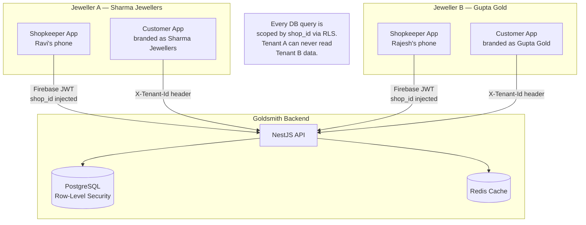
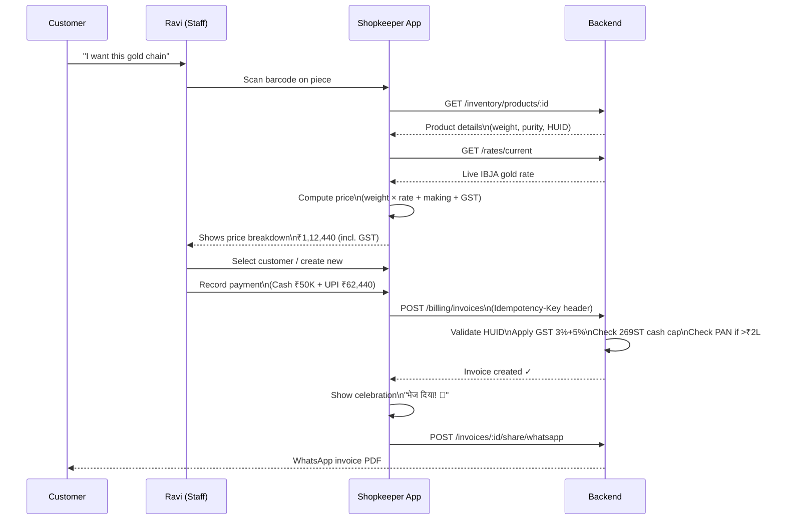
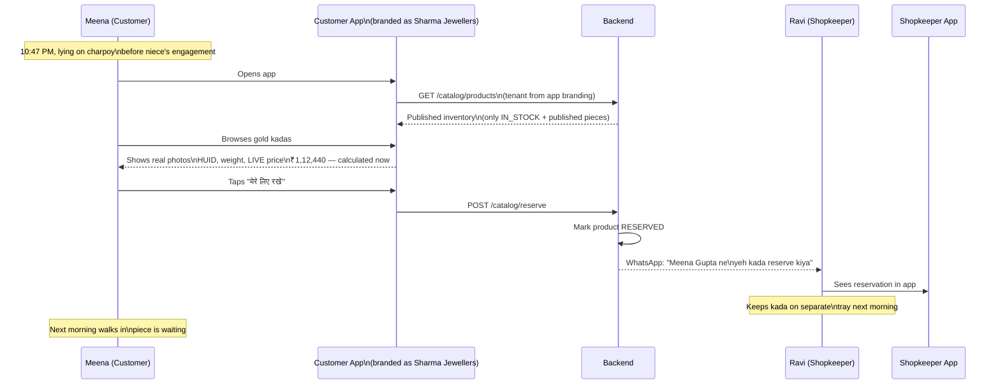
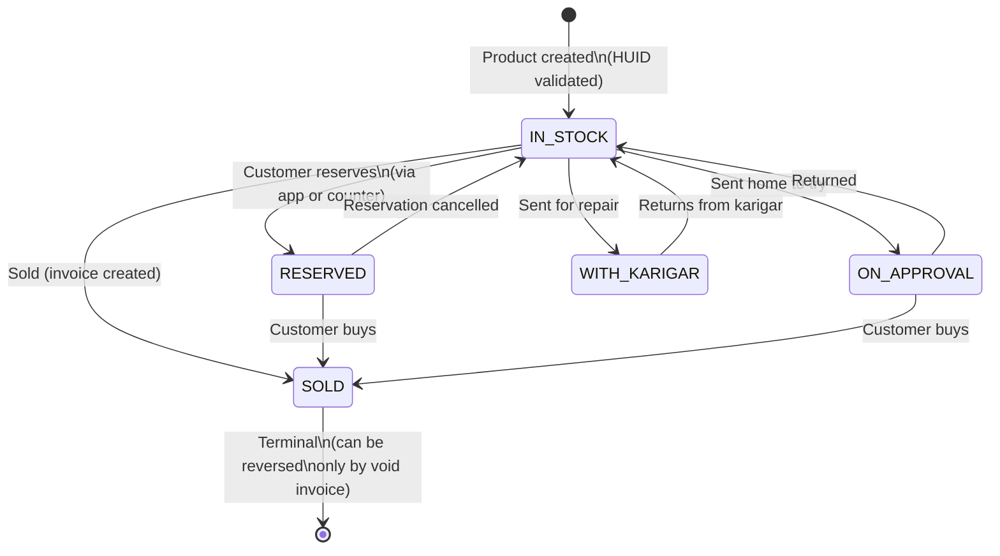
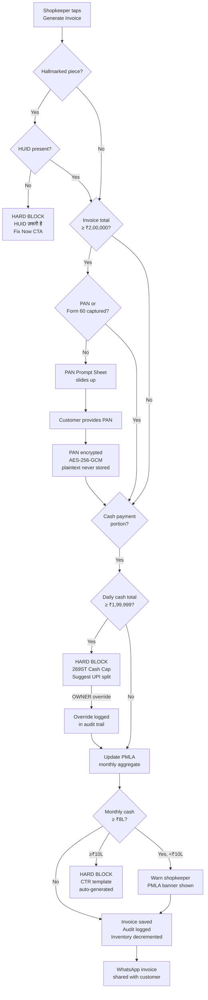

# Goldsmith — Functional Overview

**What it is:** A multi-tenant, white-label jewelry management platform for Hindi-belt Indian jewellers. One codebase powers N jewellers, each with their own branded app and data isolation. The anchor customer is a 2–5 staff jewellery shop in Ayodhya, UP.

**Business model:** Monthly / yearly SaaS subscription. Shopkeeper runs their own branded app — Goldsmith platform brand is never visible to customers.

---

## Who Uses It

| Role | Surface | What they do |
|------|---------|--------------|
| **Shop Owner** | Shopkeeper mobile app | Full access — billing, inventory, staff, settings, reports |
| **Manager** | Shopkeeper mobile app | Billing, inventory, customers — no staff management |
| **Staff** | Shopkeeper mobile app | Billing and inventory only — read-heavy |
| **Customer** | Customer mobile app + web | Browse inventory, reserve pieces, view invoices |
| **Platform Admin** | Admin console (web) | Onboard new jewellers, manage tenants |

---

## Platform Architecture (Multi-Tenant)



---

## Core User Journeys

### 1. The 90-Second Billing Loop (Primary Value)

The shopkeeper's daily core operation — customer walks in, walks out with a GST invoice in under 90 seconds.



---

### 2. Customer Discovery Loop (The Killer Feature)

Women browse the jeweller's real inventory from home and reserve pieces — drives 20% more footfall.



---

### 3. Inventory Lifecycle



---

### 4. Compliance Decision Tree (Invoice Creation)



---

## Feature Map by Epic

### Epic 1 — Authentication & Staff Management ✅
- Firebase phone OTP login (no password)
- Staff invite by OWNER → staff activates via OTP
- Role-based access: OWNER / MANAGER / STAFF
- Dynamic permissions (OWNER can grant/revoke specific actions)
- Staff revocation (Firebase refresh tokens revoked immediately)
- Immutable audit trail (every action logged, cannot be deleted)
- Logout all devices

### Epic 2 — Shop Settings ✅
- Shop profile (name, address, GSTIN, logo)
- Making charges by category (RINGS 12%, BRIDAL 15%, WHOLESALE 7% etc.)
- Wastage percentage per category
- Loyalty program tiers (Silver / Gold / Diamond with point earn/redeem rates)
- Rate-lock duration (how long a quoted price is valid)
- Try-at-home toggle + max pieces
- Custom order policy, return policy
- Notification preferences

### Epic 3 — Inventory Management ✅
- Add products: metal, purity, weight (DECIMAL 12,4 — never float), HUID, images
- Barcode (Code 128) label printing — scan at billing counter
- CSV bulk import (for anchor onboarding of 240+ existing pieces)
- Product status state machine (IN_STOCK → RESERVED → SOLD etc.)
- Publish/unpublish to customer app
- **Offline sync** — WatermelonDB on device; sync within 30s on reconnect
- Live stock valuation at today's gold rate
- Stock movements ledger (PMLA-compliant, immutable, 5-year retention)
- Meilisearch inventory search (Hindi + English transliteration)
- Dead stock dashboard (pieces unsold > configurable threshold)

### Epic 4 — Gold Rates ✅
- IBJA auto-fetch every 15 minutes (primary rate source)
- Metals.dev fallback with circuit breaker
- Last-known-good cache (serves stale rates when both sources fail)
- Manual rate override by OWNER (audit logged with reason)
- Rate history chart (30 / 90 / 365 days)
- Live rate widget on customer app home screen
- Canonical pricing formula:
  ```
  total = (weight × rate) + making_charge + stone_charges
          + GST_metal(3%) + GST_making(5%) + hallmark_fee
  ```
  All arithmetic via decimal.js — zero float usage enforced by Semgrep.

### Epic 5 — Billing (Partial — in active development)
- **Done:** B2C invoice creation with GST 3%+5%, HUID validation
- **Done:** Making charges from shop settings (category-aware)
- **Done:** PAN Rule 114B — hard block at ₹2L, PAN encrypted (AES-256-GCM)
- **Done:** Section 269ST — cash cap hard block at ₹1,99,999/day/customer
- **Done:** PMLA cumulative tracking — warn at ₹8L, block at ₹10L + CTR auto-generate
- **Done:** B2B wholesale invoice (GSTIN validation, CGST/SGST vs IGST treatment)
- **Done:** Invoice void within 24h (OWNER only) + credit note after window
- **In progress:** Razorpay split payment (cash + UPI + card + old-gold)
- **In progress:** URD old-gold purchase with RCM self-invoice (3% GST, jeweller's liability)
- **Planned:** Invoice PDF + WhatsApp share (tenant-branded)
- **Planned:** GSTR-1 / GSTR-3B CSV export
- **Planned:** End-to-end integration test (anchor first invoice in < 90 seconds)

### Epic 6 — Customer CRM (In active development)
- Customer records: phone (primary key per shop), name, PAN encrypted, address, DOB year
- Family links (mother↔daughter, spouse↔spouse etc. — for bridal context)
- Purchase history across all staff and dates
- Credit balance (outstanding dues + advance payments)
- Private notes per customer (staff-visible, author-controlled delete)
- Occasions (birthday, anniversary) with 7-day-before WhatsApp reminders
- Customer search (Meilisearch with Hindi/English transliteration, masked phone)
- DPDPA-compliant data deletion workflow

### Epic 7 — Customer App (Planned)
- Product catalog (browse by metal, weight, price, occasion)
- Live gold rate widget on home
- Product reservation ("मेरे लिए रखें")
- Invoice viewing (customer's own purchase history)
- WhatsApp-first sharing (product links, invoice PDFs)
- Mobile web first (no app install required for discovery)

### Epics 8–16 — Planned
| Epic | Feature |
|------|---------|
| 8 | Loyalty accrual + redemption |
| 9 | Rate-lock (quote valid for N days, price guaranteed) |
| 10 | Custom orders (design, karigar workflow, deposit, delivery) |
| 11 | Try-at-home workflow (piece goes home, returns or converts to sale) |
| 12 | Walk-in context (customer history shown when they arrive) |
| 13 | WhatsApp notifications (AiSensy BSP — occasion reminders, invoice share, rate alerts) |
| 14 | Analytics + reports (shopkeeper intelligence dashboard) |
| 15 | Platform admin (onboard new jewellers, tenant provisioning) |
| 16 | Multi-store (single owner, multiple shop locations) |

---

## Key Compliance Rules (Platform-Enforced, Not Configurable)

| Rule | Threshold | Action |
|------|-----------|--------|
| Section 269ST | Cash ≥ ₹1,99,999 in single transaction/day | Hard block — suggest UPI |
| PAN Rule 114B | Invoice total ≥ ₹2,00,000 | Hard block — collect PAN or Form 60 |
| PMLA Warning | Monthly cash per customer ≥ ₹8,00,000 | Shopkeeper warned |
| PMLA Block | Monthly cash per customer ≥ ₹10,00,000 | Hard block + CTR template auto-generated |
| GST rates | Metal 3%, Making 5% | Hardcoded — not editable |
| HUID | All hallmarked pieces | Required on every invoice line |
| Weight precision | All weight columns | DECIMAL(12,4) — never float |

---

## What Makes This Defensible

1. **Compliance automation** — 269ST, PAN, PMLA, HUID are hard-blocks enforced by the system. The jeweller cannot accidentally violate them. Competitors (Tally, Vyapar) require manual discipline.

2. **Multi-tenant RLS** — Row-level security in PostgreSQL ensures zero cross-tenant data leakage. Scales to N jewellers with no per-tenant infrastructure.

3. **Hindi-first UX** — Built for a 50-year-old Ayodhya jeweller, not translated English. 48dp touch targets, 16pt minimum font, high contrast.

4. **Customer discovery loop** — Women browse real inventory from home at night, reserve pieces. No competitor does this for tier-2/3 Hindi-belt jewellers.

5. **White-label** — Every jeweller's customers see only their brand. Goldsmith is invisible to end customers.
